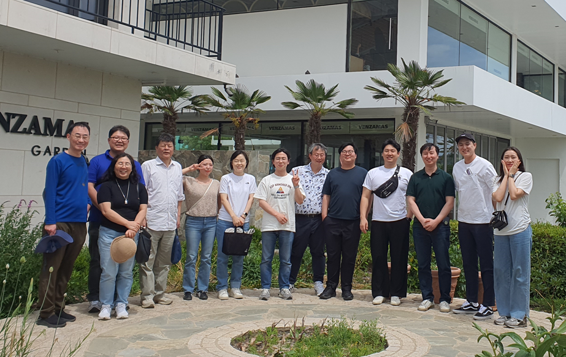

Contributing Authors
=====================

* ID03 Coherent X-ray Diffraction (CoXRD)
    * Daseul Ham
* ID04 Coherent Small Angle X-ray Scattering (CoSAXS)
    * Jehan Kim
* ID10 NanoProbe
    * Jaeyong Shin
* BM10 High Energy Microscopy (HEM)
    * Yong Sung Park
* ID21 BioPharma-BioSAXS (BioSAXS)
    * Yeongsik Kim
* ID22 Bio Nano Crystallography (BioNX)
    * Mi-Jeong Kwak
* ID23 RealTime XAFS (RTXAFS)
    * Kwon Ik Seon
* ID24 Material Structure Analysis (MSA)
    * Changwan Ha
* ID25 NanoARPES
    * Ki-jeong Kim
* ID26 Soft X-ray NanoProbe (softNanoProbe)
    * Ki-jeong Kim
* Editor
    * Jae-Hong Lim

.. raw:: html
    
Beamline Science Team

