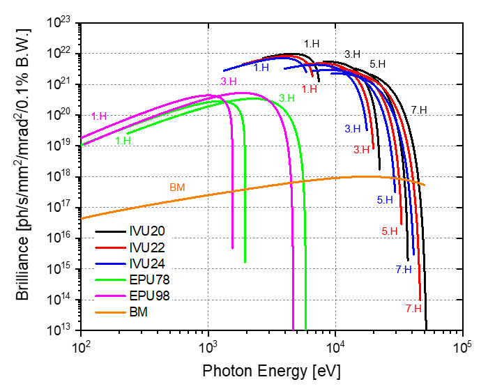
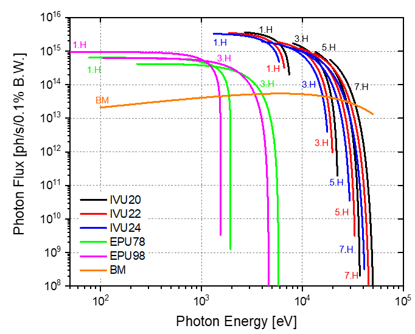
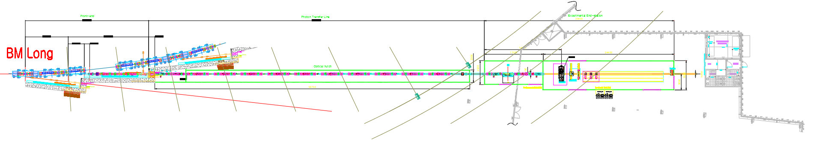
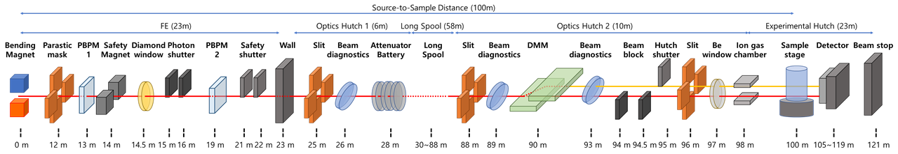
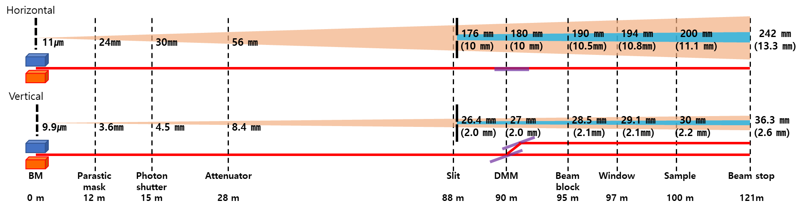

``BM10`` High Energy Microscopy (HEM)
=================================

1. Introduction
----------------

High-energy microscopy is one of the long beamlines exceeding 100
meters, providing CT images based on projection image technology.
Imaging is performed in a monochromatic beam range of 5 to 40 keV and a
white beam range of up to 100 keV, with photons supplied from a central
bending magnet. The High-Energy Microscopy beamline consists of two
optical hutches and one end station. The first optical hutch is located
in an experimental building (storage building) approximately 27 meters
from the source, and the other two are located in separate buildings at
85 meters and 95 meters, respectively. A separate building is shared
with another long beamline, the ID10 nano-probe beamline.

2. Scientific objectives
-----------------------

Synchrotron source provide highly brilliant and collimated X-rays, which
are essential for achieving high-resolution imaging. Microtomography
(μCT) using synchrotron radiation has significantly advanced the
nondestructive three-dimensional imaging capabilities across various
scientific disciplines such as medicine, biology, and materials science.
Superior imaging capabilities allow for detailed studies of internal
structures such as porosity, grain morphology, and defects without
destructive sample treatment. The transition from incoherent to coherent
X-ray sources will open up new scientific discoveries and possibilities
in medicine, biology and materials science.

**2.1 Improved Contrast and Resolution Imaging**

Synchrotron-based μCT continues to evolve with advancements in X-ray
sources and imaging techniques. Due to the divergence of the incoherent
X-ray source, the spatial resolution achievable in the tomogram is
limited to about 2 μm. Increasing the coherence of the X-ray beam is
expected to significantly improve spatial resolution. Phase contrast
imaging utilizes increased photon flux and coherence ratio to improve
spatial resolution and contrast. This technique improves sensitivity to
structural changes in the specimen while minimizing its impact on the
sample. Improved spatial resolution and sensitivity allow researchers to
resolve finer structural details in three-dimensional imaging, expanding
the range of observations in materials and biological specimens.

**2.2 4D Materials Science (Dynamics study of in-situ/operando)**

Imaging beamlines utilizing 4th generation light sources can be
optimized for performing μCT on bulk samples. Enhanced photon flux and
contrast improve acquisition times for dynamic imaging, supporting rapid
data acquisition for materials modeling and validation. This enables
real-time 3D imaging (4D) of materials behavior, facilitating direct
comparison between experimental and simulated data.

**2.3 Multiscale Imaging**

Multiscale imaging provides wide spatial resolution in absorption and
phase contrast imaging, enabling detailed studies of microstructures
ranging from hundreds of nanometers to several millimeters. This
approach implies a comprehensive understanding of material structures
and processes.

3. Beamline Requirements for the Insertion Device (Bending magnet)
-----------------------------------------------------------------

High-energy microscope beamlines require high-brightness sources that
can cover the X-ray energy spectrum from 5 keV to over 100 keV and small
source sizes to maximize phase contrast effects. To meet these
requirements, bending magnets or superbend magnets are needed that can
provide high fields at short device periods.

Bending magnets are essential components of synchrotron facilities used
to steer electron beams along circular paths, and the performance of the
magnets is critical to the overall functioning of the beamline in terms
of brilliance and flux. Figures 1 and Table 1 illustrate the brilliance
and flux curves for bending magnets, showing their capabilities at
various photon energies.

|EMB00004d785b5f| |EMB00004d785b61|

**Figure 1**. Predicted brilliance and flux of the Insertion Devices.

**Table 1**. Source Parameters for HEM beamline.

+-------------+-------------+--------------+-------------+-------------+
| Source Type | Magnetic    | Magnetic     | Total Power | Critical    |
|             | Field       | Radius       |             | Energy      |
+=============+=============+==============+=============+=============+
| Bending     | 2T          | 6.67 m       | 1.36 kW     | 21 keV      |
| magnet      |             |              |             |             |
+-------------+-------------+--------------+-------------+-------------+

Bending magnets have magnetic fields as high as 2 Tesla, with a critical
energy of 21 keV and a usable energy range of up to 100 keV. The
extended energy range covering up to 100 keV supports a wide array of
experimental techniques and applications, including studies of dense
materials and high-energy processes. High flux and brightness enable
more detailed, higher resolution imaging and analysis, which are
essential for advancements in materials science, biology, and chemistry.

Bending magnets can be upgraded to superbend magnets in the future to
provide an immediate improvement in beamline performance while
preserving the existing beamline design. Superbend magnets are
specialized magnets designed to enhance the performance of synchrotron
beamlines by generating higher flux and brilliance, particularly at
higher photon energies. High photon energy allows for more accurate and
detailed investigations in various scientific domains such as imaging,
X-ray absorption fine structure (XAFS), and scattering. We anticipate
meeting future scientific requirements by keeping open the option to
upgrade our imaging beamline.

4. Beamline Requirements for the Front End
-------------------------------------------

The layout of the beamline is split into two parts separated by a
ratchet-shaped storage ring tunnel wall, and the inside of the ring
tunnel wall is the front-end (FE). The FE is designed to protect both
personnel and equipment on the beamline, as well as the machinery in the
event of a vacuum failure on the beamline.

The HEM beamline requires a new high heat load front end capable of
handling a total power of 1.36 kW with a beam divergence of 2.0 mrad
horizontally and 0.3 mrad vertically. The front end of the HEM beamline
is designed to respond to beamline issues while minimizing entry and
exit. Table 2 shows an overview of the components and functions of the
HEM beamline front end.

**Table 2.** Component list of the front-end in the HEM beamline

+--------------+-------------------+-----------------------------------+
| Distance     | Component         | Description/Comments              |
| from source  |                   |                                   |
| (m)          |                   |                                   |
+==============+===================+===================================+
| 0            | Bending magnet    | Source (2 T)                      |
+--------------+-------------------+-----------------------------------+
| 12           | Parastic Mask     | (H) 2 mrad x (V) 0.3 mrad         |
+--------------+-------------------+-----------------------------------+
| 12.5         | Beam stopper      | Absorb of high-energy             |
|              |                   | Bremsstrahlung radiation          |
+--------------+-------------------+-----------------------------------+
| 13           | PBPM1             | Diamond-blade                     |
+--------------+-------------------+-----------------------------------+
| 14           | Safety Magnet     | Electron Stop                     |
+--------------+-------------------+-----------------------------------+
| 14.5         | Diamond window    | Vacuum separate                   |
+--------------+-------------------+-----------------------------------+
| 15           | Photon Shutter 1  | Main beam blocking                |
+--------------+-------------------+-----------------------------------+
| 16           | Photon Shutter 2  | spare component                   |
+--------------+-------------------+-----------------------------------+
| 19           | PBPM2             | diamond-blade                     |
+--------------+-------------------+-----------------------------------+
| 21           | Safety Shutter 1  | beam diagnostics & Shockwave      |
|              |                   | Blocking                          |
+--------------+-------------------+-----------------------------------+
| 22           | Safety Shutter 2  | spare component                   |
+--------------+-------------------+-----------------------------------+

5. Beamline Layout
-----------------

|image1|

**Figure 2**. Layout for High Energy Microscopy beamline

The High Energy Microscopy beamline will be one of two long beamlines
built at the Korea-4GSR. Located at BM-10, High Energy Microscopy
beamline extends beyond the exterior wall of the storage ring building,
allowing for a sample position that is located at 100 meters from
source.

|EMB000373300f73|

**Figure 3.** Conceptual layout of the High Energy Microscopy beamline
indicating diagnostics, x-ray optics, sample location, and detector.

The conceptual layout of beamline shown in Figure 3 displays x-ray
optics, sample environments, and detector.

**5.1 Beamline Component Table**

   Table 3 shows all major beamline components and lists them in order
   of distance from the source.

**Table 3.** High Energy Microscopy beamline component table

+----------+---------+--------------+--------------------------------+
| **Lo     | **D     | *            | **Description/Comments**       |
| cation** | istance | *Component** |                                |
|          | from**  |              |                                |
|          |         |              |                                |
|          | *       |              |                                |
|          | *source |              |                                |
|          | (m)**   |              |                                |
+==========+=========+==============+================================+
| Front    | 0       |    Source    | Bending magnet (2T)            |
| End      |         |              |                                |
|          |         |              |                                |
| (0 - 23  |         |              |                                |
| m)       |         |              |                                |
+----------+---------+--------------+--------------------------------+
|          | 12      |    Parastic  | (H) 2 mrad x (V) 0.3 mrad      |
|          |         |    Mask      |                                |
+----------+---------+--------------+--------------------------------+
|          | 12.5    |    Beam      | Absorb of high-energy          |
|          |         |    stopper   | Bremsstrahlung radiation       |
+----------+---------+--------------+--------------------------------+
|          | 13      |    PBPM1     | Diamond-blade                  |
+----------+---------+--------------+--------------------------------+
|          | 14      |    Safety    | Electron Stop                  |
|          |         |    Magnet    |                                |
+----------+---------+--------------+--------------------------------+
|          | 14.5    |    Diamond   | Vacuum separate                |
|          |         |    window    |                                |
+----------+---------+--------------+--------------------------------+
|          | 15      |    Photon    | Main beam blocking             |
|          |         |    Shutter 1 |                                |
+----------+---------+--------------+--------------------------------+
|          | 16      |    Photon    | spare component (Photon        |
|          |         |    Shutter 2 | Shutter)                       |
+----------+---------+--------------+--------------------------------+
|          | 19      |    PBPM2     | diamond-blade                  |
+----------+---------+--------------+--------------------------------+
|          | 21      |    Safety    | beam diagnostics & Shockwave   |
|          |         |    Shutter 1 | Blocking                       |
+----------+---------+--------------+--------------------------------+
|          | 22      |    Safety    | spare component (Safety        |
|          |         |    Shutter 2 | Shutter)                       |
+----------+---------+--------------+--------------------------------+
| Wall     | 23 -    |    Wall      | Front End Radiation blocking   |
|          | 24.8    |              |                                |
| (23 -    |         |              |                                |
| 24.8 m)  |         |              |                                |
+----------+---------+--------------+--------------------------------+
| Optical  | 25      |    Slit      | Beam size defining and heat    |
| Hutch 1  |         |              | absorption                     |
|          |         |              |                                |
| (24.8 -  |         |              |                                |
| 30 m)    |         |              |                                |
+----------+---------+--------------+--------------------------------+
|          | 26      |    On-line   | beam diagnostics               |
|          |         |              |                                |
|          |         |  Diagnostics |                                |
+----------+---------+--------------+--------------------------------+
|          | 28      |    Filter    | White Beam Filter (low energy  |
|          |         |    Array     | cut-off)                       |
+----------+---------+--------------+--------------------------------+
| Long     | 45      |    Long      | Beam transfer (UHV)            |
| spool    |         |    spool     |                                |
|          |         |              |                                |
| (30 - 88 |         |              |                                |
| m)       |         |              |                                |
+----------+---------+--------------+--------------------------------+
| Optical  | 88      |    Slit      | DMM Beam size defining         |
| Hutch 2  |         |              |                                |
|          |         |              |                                |
| (88 - 98 |         |              |                                |
| m)       |         |              |                                |
+----------+---------+--------------+--------------------------------+
|          | 89      |    On-line   | beam diagnostics               |
|          |         |              |                                |
|          |         |  Diagnostics |                                |
+----------+---------+--------------+--------------------------------+
|          | 90      |    M         | Double Multilayer              |
|          |         | onochromator | Monochromator (5 – 40 keV)     |
+----------+---------+--------------+--------------------------------+
|          | 93      |    On-line   | beam diagnostics               |
|          |         |              |                                |
|          |         |  Diagnostics |                                |
+----------+---------+--------------+--------------------------------+
|          | 94      |    White     | Movable white beam /           |
|          |         |    Beam      | Bremsstrahlung stop            |
|          |         |    Block 1   |                                |
+----------+---------+--------------+--------------------------------+
|          | 94.5    |    White     | spare component (White Beam    |
|          |         |    Beam      | Block)                         |
|          |         |    Block 2   |                                |
+----------+---------+--------------+--------------------------------+
|          | 95      |    Hutch     | White / Mono beam stop         |
|          |         |    Shutter   |                                |
+----------+---------+--------------+--------------------------------+
|          | 96      |    Exit slit | Final Beam size defining       |
+----------+---------+--------------+--------------------------------+
|          | 97      |    Exit      | Be window (UHV, > 200 mm,      |
|          |         |    window    | water cooled)                  |
+----------+---------+--------------+--------------------------------+
|          | 98      |    Ion gas   | beam diagnostics (mono beam,   |
|          |         |    chamber   | I0)                            |
+----------+---------+--------------+--------------------------------+
| Exp.     | 100     |    Sample    | Heavy Load Air-Bearing Stage   |
| Hutch    |         |    stage 1   |                                |
|          |         |              |                                |
| (98 -    |         |              |                                |
| 121 m)   |         |              |                                |
+----------+---------+--------------+--------------------------------+
|          | 102     |    Sample    | Light Load Air-Bearing Stage   |
|          |         |    stage 2   |                                |
+----------+---------+--------------+--------------------------------+
|          | 104 –   |    Detector  | Phase contrast effect          |
|          | 119     |    station   |                                |
+----------+---------+--------------+--------------------------------+
|          | 104.5 - |    Detector  | Mono-beam X-ray microscope     |
|          | 116.5   |    1         | (High magnification)           |
+----------+---------+--------------+--------------------------------+
|          | 105.5 – |    Detector  | White-beam X-ray microscope    |
|          | 117.5   |    2         | (High magnification)           |
+----------+---------+--------------+--------------------------------+
|          | 106.5 – |    Detector  | Large FOV lX-ray microscope    |
|          | 118.5   |    3         | (Low magnification)            |
+----------+---------+--------------+--------------------------------+
|          | 121     |    Beam Stop | White Beam Stop, Fixed, Cooled |
+----------+---------+--------------+--------------------------------+

6. Optics Overview
-----------------

**6.1 Beam Delivery Specifications**

The energy range of the HEM beamline is from 5 keV to 100 keV and is
planned to operate in monochromatic mode from 5 keV to 40 keV and in
white beam mode above 40 keV.

6.1.1 Monochromatic beam mode

Monochromatic mode using a DMM provides a narrow band of optimized
energy for experiments. Because the size of the available beam is
structurally limited in DMM, the incident beam size must be defined
using a slit.

6.1.2 White beam mode

In white beam mode, a low energy cut-off filter is used to optimize the
beam energy. The opening beam size of the bending magnet is maintained
at 2 m rad in the horizontal direction and 0.3 m rad in the vertical
direction. Consequently, at the sample position, which is located 100
meters from the light source, a beam size of 200 x 30 mm is achievable.

The beam performance of Monochromatic beam and white beam mode are
controlled by slit’s, filers, and DMM, and the expected performance and
parameters are shown in Table 4.

**Table 4**. Performance parameters of Monochromatic beam and white beam
mode in the HEM beamline.

+----------+---------+--------------+----------------+----------------+
| **Beam   | **D     | *            | **Beam size    | **Beam Power   |
| mode**   | istance | *Component** | FWHM**         | (abs., W)**    |
|          | from**  |              |                |                |
|          |         |              | **(H x V,      |                |
|          | *       |              | mm)**          |                |
|          | *source |              |                |                |
|          | (m)**   |              |                |                |
+==========+=========+==============+================+================+
| White    | 0       |    Source    | 0.011 x 0.0099 | 389.0          |
| beam     |         |              |                |                |
+----------+---------+--------------+----------------+----------------+
|          | 14.5    |    Diamond   | 29 x 4.35      | 387.0 (49.3)   |
|          |         |    window    |                |                |
+----------+---------+--------------+----------------+----------------+
|          | 25      |    4-Slit    | 50 x 7.5       | 337.8 (0)      |
+----------+---------+--------------+----------------+----------------+
|          | 28      |              | 56 x 8.4       | 337.7 (303.7)  |
|          |         |   Attenuator |                |                |
|          |         |    (Cu 1mm)  |                |                |
+----------+---------+--------------+----------------+----------------+
|          | 88      |    4-Slit    | 176 x 26.4     | 34.0 (0)       |
+----------+---------+--------------+----------------+----------------+
|          | 90      |    DMM       | 180 x 27       | 34.0 (0)       |
+----------+---------+--------------+----------------+----------------+
|          | 96      |    4-Slit    | 194 x 29.1     | 34.0 (0)       |
+----------+---------+--------------+----------------+----------------+
|          | 97      |    Be window | 196 x 29.4     | 34.0 (0.6)     |
|          |         |    (1mm)     |                |                |
+----------+---------+--------------+----------------+----------------+
|          | 100     |    Sample    | 200 x 30       | 33.4 (0)       |
+----------+---------+--------------+----------------+----------------+
|          | 121     |    Beam stop | 242 x 26.3     | 33.4 (33.4)    |
+----------+---------+--------------+----------------+----------------+
| Mono     | 0       |    Source    | 0.011 x 0.0099 | 389.0          |
| beam     |         |              |                |                |
+----------+---------+--------------+----------------+----------------+
|          | 14.5    |    Diamond   | 29 x 4.35      | 387.0 (49.3)   |
|          |         |    window    |                |                |
+----------+---------+--------------+----------------+----------------+
|          | 25      |    4-Slit    | 25 x 3.8       | 337.7 (102.9)  |
+----------+---------+--------------+----------------+----------------+
|          | 28      |              | 28 x 4.2       | 127.8 (0)      |
|          |         |   Attenuator |                |                |
+----------+---------+--------------+----------------+----------------+
|          | 88      |    4-Slit    | 10 x 2         | 127.8 (125.2)  |
+----------+---------+--------------+----------------+----------------+
|          | 90      |    DMM       | 10 x 2         | 2.6 (2.5)      |
+----------+---------+--------------+----------------+----------------+
|          | 96      |    4-Slit    | 10.6 x 2.1     | 0.1 (0)        |
+----------+---------+--------------+----------------+----------------+
|          | 97      |    Be-window | 10.8 x 2.1     | 0.1 (0)        |
+----------+---------+--------------+----------------+----------------+
|          | 100     |    Sample    | 11.1 x 2.2     | 0.1 (0)        |
+----------+---------+--------------+----------------+----------------+
|          | 121     |    Beam stop | 13.3 x 2.6     | 0.1 (0.1)      |
+----------+---------+--------------+----------------+----------------+

**6.2 Detailed Optical Layout**

6.2.1 Ray-tracing (Horizontal, Vertical)

Optics configuration for projection imaging in Monochromatic beam and
white beam modes is shown in Figure 4.

|image2|

**Figure 4**. Optics configuration (horizontal/upper, vertical/lower)
for projection imaging.

**6.3 Optics Specifications**

6.3.1 Windows

6.3.2 Slits

6.3.3 Filters

6.3.4 Monochromators

6.3.5 Blocks

**6.4 Heat Load Considerations**

6.4.1 Windows & energy filters

