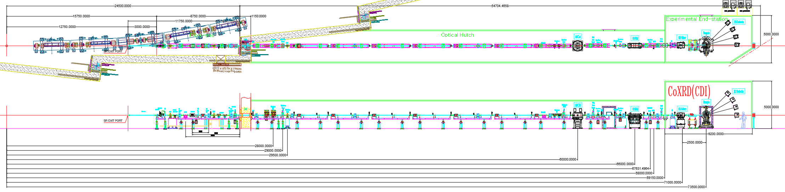

``ID03`` Coherent X-ray Diffraction (CoXRD)
=================================

1. Introduction
--------------

2. Scientific Objective
-----------------------

..

   The coherent X-ray diffraction beamline is one of the most active
   beamlines utilizing the coherence characteristics of the 4GSR light
   source. This beamline focuses on supporting coherent X-ray
   diffraction imaging and microbeam diffraction research by highly
   focusing light sources with excellent coherence. Additionally, we
   plan to support real-time X-ray diffraction research using a
   diffractometer.

   This beamline will provide a spatial resolution of less than 10 nm
   for coherent X-ray diffraction imaging. In Korea, Bragg CDI, one of
   the advanced techniques in coherent X-ray diffraction imaging, is
   actively used in research on secondary battery, catalyst, and
   semiconductor materials. This imaging technique enables the study of
   dynamic processes such as complex structures, defect formation and
   growth, and material changes. Furthermore, it greatly contributes to
   understanding the properties of various materials by directly
   observing microscopic physical phenomena at the nanoscale. These
   observations can be applied to various fields, including industrial
   applications and the development and application of next-generation
   materials. This beamline aims to increase the utilization of coherent
   X-ray diffraction imaging and microbeam X-ray diffraction.

3. Beamline Requirements for the Insertion Devices
-------------------------------------------------

..

   ID03 will be installed in-vacuum undulator with a period of 22 mm of
   3 m length.

   The ID of the ID03 beamline is available in a continuous energy range
   and from 3 keV.

.. table:: Table 1. ID03 Coherent X-ray Diffraction Source Parameters

   +--------------+----------+----------+----------+----------+----------+
   | **Beamline** | **Und    | **       | **       | **Max    | **Max K  |
   |              | ulator** | Period** | Length** | Power**  | value**  |
   |              |          |          |          |          |          |
   |              |          | **(mm)** | **(m)**  | **(kW)** |          |
   +==============+==========+==========+==========+==========+==========+
   | Coherent     | I        | 22       | 3        | 15.165   | 2.315    |
   | X-ray        | n-vacuum |          |          |          |          |
   | Diffraction  |          |          |          |          |          |
   +--------------+----------+----------+----------+----------+----------+

4. Beamline Requirements for the Front End
-----------------------------------------

..

   The FE of this beamline is designed for all optical component under
   the following conditions. (Reference the 4GSR beamline FE section)

-  Structural stress due to heat load should not exceed the yield
   strength.

-  The temperature rise due to heat load should not exceed the softening
   temperature of the materials.

-  The LCW temperature of the wall should not exceed the boiling point
   of water.

..

   The maximum power drawn from the IVU22 is 15.165 kW, and the overall
   power is gradually removed in the FE. The power of the beam
   ultimately emitted from the FE is 120 W. The FE Movable Mask is
   located right in front of the photon shutter at the end of the FE,
   where it roughly conditions the beam to FWHM before it is incident on
   the PTL.

5. Beamline Layout
--------------------

..

   |image1|

6. **Beamline Component Table**

.. table:: Table 2. Coherent X-ray Diffraction Beamline Component Table

   +----------+------------------------+----------------------------------+
   | **Di     | **Component**          | **Description**                  |
   | stance** |                        |                                  |
   |          |                        |                                  |
   | **(m)**  |                        |                                  |
   +==========+========================+==================================+
   | 22.5     | Movable mask           | 4-way slit, UHV, Water cooling   |
   +----------+------------------------+----------------------------------+
   | 23.8     | Safety shutter         |                                  |
   +----------+------------------------+----------------------------------+
   | 28       | White beam filter      | Graphite : 0.5 mm, 1 mm, 2 mm    |
   |          |                        |                                  |
   |          |                        | Diamond : 0.1 mm, 0.2 mm, 0.5 mm |
   +----------+------------------------+----------------------------------+
   | 29       | White beam screen      | Diamond window,                  |
   |          |                        |                                  |
   |          |                        | Fluorescent metal screen,        |
   |          |                        | current signal output            |
   +----------+------------------------+----------------------------------+
   | 29.5     | White beam PBPM        | 4-Blade-type                     |
   +----------+------------------------+----------------------------------+
   | 56.5     | ID Photon shutter      |                                  |
   +----------+------------------------+----------------------------------+
   | 57.9     | White beam slits       | 4-way slit, UHV, Water cooling   |
   +----------+------------------------+----------------------------------+
   | 58.6     | White beam screen      | Diamond window                   |
   |          |                        |                                  |
   |          |                        | Fluorescent metal screen,        |
   |          |                        | current signal output            |
   +----------+------------------------+----------------------------------+
   | 60       | HDCM                   | Si (111), fixed exit             |
   +----------+------------------------+----------------------------------+
   | 61.7     | White beam screen      | Diamond window                   |
   |          |                        |                                  |
   |          |                        | Fluorescent metal screen,        |
   |          |                        | current signal output            |
   +----------+------------------------+----------------------------------+
   | 62.1     | Mono beam screen       | YAG window                       |
   |          |                        |                                  |
   |          |                        | Fluorescent metal screen,        |
   |          |                        | current signal output            |
   +----------+------------------------+----------------------------------+
   | 62.5     | FCS                    |                                  |
   +----------+------------------------+----------------------------------+
   | 64.1     | Mono beam slits        | 4-way slit, UHV                  |
   +----------+------------------------+----------------------------------+
   | 64.5     | Mono beam screen       | YAG window                       |
   |          |                        |                                  |
   |          |                        | Fluorescent metal screen,        |
   |          |                        | current signal output            |
   +----------+------------------------+----------------------------------+
   | 66       | High harmonics         | 2-stripe coating (Pt, Rh)        |
   |          | rejection mirror       |                                  |
   +----------+------------------------+----------------------------------+
   | 67       | Mono beam slits        | 4-way slit, UHV                  |
   +----------+------------------------+----------------------------------+
   | 67.6     | Mono beam screen       | YAG window                       |
   |          |                        |                                  |
   |          |                        | Fluorescent metal screen,        |
   |          |                        | current signal output            |
   +----------+------------------------+----------------------------------+
   | 68       | Beam position monitor  | UHV QBPM, Ti foil : 500 nm / Ni  |
   |          |                        | foil : 500 nm                    |
   +----------+------------------------+----------------------------------+
   | 68.8     | Hutch shutter          |                                  |
   +----------+------------------------+----------------------------------+
   | 70.3     | Slits                  | 4-way slit, UHV                  |
   +----------+------------------------+----------------------------------+
   | 71       | KB mirror              | 2-stripe coating (Pt, Rh),       |
   |          |                        | Vertical/Horizontal focusing,    |
   |          |                        | Pair                             |
   +----------+------------------------+----------------------------------+
   |          | Be window              | Double-side polished,            |
   |          |                        | 127-um-thick                     |
   +----------+------------------------+----------------------------------+
   |          | Slits                  | 4-way slit, HV                   |
   +----------+------------------------+----------------------------------+
   |          | Beam position monitor  | HV QBPM, Ti foil : 500 nm / Ni   |
   |          |                        | foil : 500 nm                    |
   +----------+------------------------+----------------------------------+
   |          | Attenuator             | 8-channel (Al, Mn + block)       |
   +----------+------------------------+----------------------------------+
   | 73.5     | Kappa diffractometer   | LM-guide or Air-bearing base     |
   |          |                        | plate                            |
   +----------+------------------------+----------------------------------+

