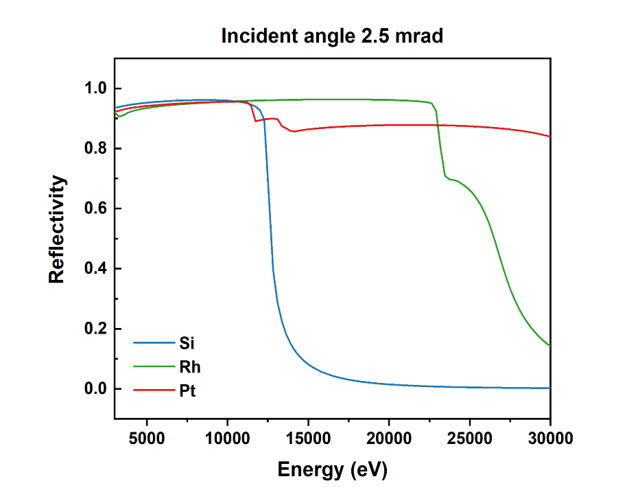
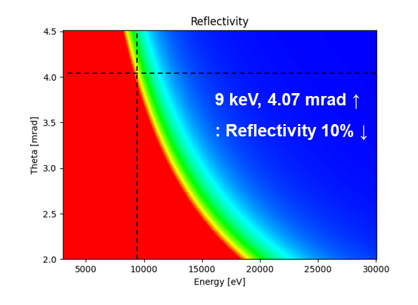

``ID03`` Coherent X-ray Diffraction (CoXRD)
=================================

1. Introduction
--------------

2. Scientific Objective
-----------------------

The coherent X-ray diffraction beamline is one of the most active
beamlines utilizing the coherence characteristics of the 4GSR light
source. This beamline focuses on supporting coherent X-ray diffraction
imaging and microbeam diffraction research by highly focusing light
sources with excellent coherence. Additionally, we plan to support
real-time X-ray diffraction research using a diffractometer.

This beamline will provide a spatial resolution of less than 10 nm for
coherent X-ray diffraction imaging. In Korea, Bragg CDI, one of the
advanced techniques in coherent X-ray diffraction imaging, is actively
used in research on secondary battery, catalyst, and semiconductor
materials. This imaging technique enables the study of dynamic processes
such as complex structures, defect formation and growth, and material
changes. Furthermore, it greatly contributes to understanding the
properties of various materials by vhgkddirectly observing microscopic
physical phenomena at the nanoscale. These observations can be applied
to various fields, including industrial applications and the development
and application of next-generation materials. This beamline aims to
increase the utilization of coherent X-ray diffraction imaging and
microbeam X-ray diffraction.

3. Beamline Requirements for the Insertion Devices
--------------------------------------------------

ID03 will be installed in-vacuum undulator with a period of 22 mm of 3 m
length.

The ID of the ID03 beamline is available in a continuous energy range
and from 3 keV.

.. table:: Table 1. ID03 Coherent X-ray Diffraction Source Parameters

   +--------------+----------+----------+----------+----------+----------+
   | **Beamline** | **Und    | **       | **       | **Max    | **Max K  |
   |              | ulator** | Period** | Length** | Power**  | value**  |
   |              |          |          |          |          |          |
   |              |          | **(mm)** | **(m)**  | **(kW)** |          |
   +==============+==========+==========+==========+==========+==========+
   | **Coherent   | I        | 22       | 3        | 15.165   | 2.315    |
   | X-ray        | n-vacuum |          |          |          |          |
   | D            |          |          |          |          |          |
   | iffraction** |          |          |          |          |          |
   +--------------+----------+----------+----------+----------+----------+

4. Beamline Requirements for the Front End
------------------------------------------

The FE of this beamline is designed for all optical component under the
following conditions. (Reference the 4GSR beamline FE section)

-  Structural stress due to heat load should not exceed the yield
   strength.

-  The temperature rise due to heat load should not exceed the softening
   temperature of the materials.

-  The LCW temperature of the wall should not exceed the boiling point
   of water.

The maximum power drawn from the IVU22 is 15.165 kW, and the overall
power is gradually removed in the FE. The power of the beam ultimately
emitted from the FE is 120 W. The FE Movable Mask is located right in
front of the photon shutter at the end of the FE, where it roughly
conditions the beam to FWHM before it is incident on the PTL.

5. Beamline Layout
------------------

|image1|

.. table:: Table 2. Coherent X-ray Diffraction Beamline Component Table

   +----------+------------------------+----------------------------------+
   | **Di     | **Component**          | **Description**                  |
   | stance** |                        |                                  |
   |          |                        |                                  |
   | **(m)**  |                        |                                  |
   +==========+========================+==================================+
   | 22.5     | Movable mask           | 4-way slit, UHV, Water cooling   |
   +----------+------------------------+----------------------------------+
   | 23.8     | Safety shutter         |                                  |
   +----------+------------------------+----------------------------------+
   | 28       | White beam filter      | Graphite : 0.5 mm, 1 mm, 2 mm    |
   |          |                        |                                  |
   |          |                        | Diamond : 0.1 mm, 0.2 mm, 0.5 mm |
   +----------+------------------------+----------------------------------+
   | 29       | White beam screen      | Diamond window,                  |
   |          |                        |                                  |
   |          |                        | Fluorescent metal screen,        |
   |          |                        | current signal output            |
   +----------+------------------------+----------------------------------+
   | 29.5     | White beam PBPM        | 4-Blade-type                     |
   +----------+------------------------+----------------------------------+
   | 56.5     | ID Photon shutter      |                                  |
   +----------+------------------------+----------------------------------+
   | 57.9     | White beam slits       | 4-way slit, UHV, Water cooling   |
   +----------+------------------------+----------------------------------+
   | 58.6     | White beam screen      | Diamond window                   |
   |          |                        |                                  |
   |          |                        | Fluorescent metal screen,        |
   |          |                        | current signal output            |
   +----------+------------------------+----------------------------------+
   | 60       | HDCM                   | Si (111), fixed exit             |
   +----------+------------------------+----------------------------------+
   | 61.7     | White beam screen      | Diamond window                   |
   |          |                        |                                  |
   |          |                        | Fluorescent metal screen,        |
   |          |                        | current signal output            |
   +----------+------------------------+----------------------------------+
   | 62.1     | Mono beam screen       | YAG window                       |
   |          |                        |                                  |
   |          |                        | Fluorescent metal screen,        |
   |          |                        | current signal output            |
   +----------+------------------------+----------------------------------+
   | 62.5     | FCS                    |                                  |
   +----------+------------------------+----------------------------------+
   | 64.1     | Mono beam slits        | 4-way slit, UHV                  |
   +----------+------------------------+----------------------------------+
   | 64.5     | Mono beam screen       | YAG window                       |
   |          |                        |                                  |
   |          |                        | Fluorescent metal screen,        |
   |          |                        | current signal output            |
   +----------+------------------------+----------------------------------+
   | 66       | High harmonics         | 2-stripe coating (Pt, Rh)        |
   |          | rejection mirror       |                                  |
   +----------+------------------------+----------------------------------+
   | 67       | Mono beam slits        | 4-way slit, UHV                  |
   +----------+------------------------+----------------------------------+
   | 67.6     | Mono beam screen       | YAG window                       |
   |          |                        |                                  |
   |          |                        | Fluorescent metal screen,        |
   |          |                        | current signal output            |
   +----------+------------------------+----------------------------------+
   | 68       | Beam position monitor  | UHV QBPM, Ti foil : 500 nm / Ni  |
   |          |                        | foil : 500 nm                    |
   +----------+------------------------+----------------------------------+
   | 68.8     | Hutch shutter          |                                  |
   +----------+------------------------+----------------------------------+
   | 70.3     | Slits                  | 4-way slit, UHV                  |
   +----------+------------------------+----------------------------------+
   | 71       | KB mirror              | 2-stripe coating (Pt, Rh),       |
   |          |                        | Vertical/Horizontal focusing,    |
   |          |                        | Pair                             |
   +----------+------------------------+----------------------------------+
   |          | Be window              | Double-side polished,            |
   |          |                        | 127-um-thick                     |
   +----------+------------------------+----------------------------------+
   |          | Slits                  | 4-way slit, HV                   |
   +----------+------------------------+----------------------------------+
   |          | Beam position monitor  | HV QBPM, Ti foil : 500 nm / Ni   |
   |          |                        | foil : 500 nm                    |
   +----------+------------------------+----------------------------------+
   |          | Attenuator             | 8-channel (Al, Mn + block)       |
   +----------+------------------------+----------------------------------+
   | 73.5     | Kappa diffractometer   | LM-guide or Air-bearing base     |
   |          |                        | plate                            |
   +----------+------------------------+----------------------------------+

6. Optics Overview
-------------------

This beamline should be designed to maintain the wavefront to the
sample. Therefore, the optics are designed to minimize vibration(<100
nrad) and mirror surface slope errors(<0.1 urad).

**6.1 Optics Specifications**

.. table:: Table 3. Specifications of DCM and M1(High Harmonics
Rejection Mirror)

   +--------------------+------------------------+------------------------+
   |                    | **DCM**                | **M1**                 |
   +====================+========================+========================+
   | **Distance**       | 60                     | 66                     |
   |                    |                        |                        |
   | **(m)**            |                        |                        |
   +--------------------+------------------------+------------------------+
   | **Incidence        | -                      | 2.5 – 4.1              |
   | Angle**            |                        |                        |
   |                    |                        |                        |
   | **(mrad)**         |                        |                        |
   +--------------------+------------------------+------------------------+
   | **Shape**          | Plane                  | Flat                   |
   +--------------------+------------------------+------------------------+
   | **Surface Normal   | Horizontal             | Horizontal             |
   | direction**        |                        |                        |
   +--------------------+------------------------+------------------------+
   | **Substrate**      | Si (111)               | Si                     |
   +--------------------+------------------------+------------------------+
   | **Coating          | -                      | Rh (50), Pt (50)       |
   | Materials**        |                        |                        |
   |                    |                        |                        |
   | **(Thickness,      |                        |                        |
   | nm)**              |                        |                        |
   +--------------------+------------------------+------------------------+
   | **Substrate size   | 1\ :sup:`st` : 50      | 800 × 50               |
   | (L × W)**          |                        |                        |
   |                    | 2\ :sup:`nd` : 150     |                        |
   | **(mm × mm)**      |                        |                        |
   +--------------------+------------------------+------------------------+
   | **Roughness**      | < 0.5                  | < 0.2                  |
   |                    |                        |                        |
   | **(nm, RMS)**      |                        |                        |
   +--------------------+------------------------+------------------------+
   | **Slope error**    | < 1                    | < 0.1                  |
   |                    |                        |                        |
   | **(urad, RMS)**    |                        |                        |
   +--------------------+------------------------+------------------------+

The monochromator will be used as the DCM(Double Crystal Monochromator),
which has high energy resolution, and the crystal is Si(111), covering
the energy range of 3-30 keV. Recently manufactured DCM, made with
Si(111), can cover high energy, and optics designed with Si(111) is
mechanically more stable compared to those using Si(111) and Si(311)
pairs.

.. table:: Table 4. DCM Mechanical specifications

   +-----------------------+----------------------------------------------+
   | **Energy range**      | 3 ~ 30 keV                                   |
   +=======================+==============================================+
   | **Crystal**           | Si (111)                                     |
   +-----------------------+----------------------------------------------+
   | **Bragg angle**       | 41.234°~ 3.779°                              |
   +-----------------------+----------------------------------------------+
   | **Angel resolution**  | < 0.25 μrad                                  |
   +-----------------------+----------------------------------------------+
   | **Offset**            | 25 mm                                        |
   +-----------------------+----------------------------------------------+
   | **Motion axis**       | Bragg, gap, roll, pitch, piezo roll and      |
   |                       | pitch for feedback                           |
   +-----------------------+----------------------------------------------+

The high harmonics rejection mirror is located behind the monochromator
serves to suppress the high harmonics energy of the beam coming out of
the monochromator. Silicon crystal is FCC (Diamond structure). According
to the diffraction selection rule, if h, k, and l are all odd or all
even, and h+k+l is a multiple of 4, then n times the corresponding
energy. High energy has a high transmittance, so even if it is slightly
reflected, it affects the diffraction data. Therefore, a mirror coated
with bare Si, Rh, and Pt is used and usually the incidence angle is 2.5
mrad. The reflectivity according to energy is shown in figure 2. The
available energy range for each coating material is 5 to 12 keV for Si
(reflectivity greater than 90%), 11 to 23 keV for Rh (reflectivity
greater than 90%), and 15 to 30 keV for Pt (reflectivity greater than
80%). The incidence angle of 2.5 mrad is basically an angle calculated
to enable use up to 30 keV, which is the target energy of this beamline.
When using tender energy, the incidence angle must be changed up to 4.07
mrad to reduce the reflectivity of the harmonic energy corresponding to
the tender energy by 10%. When using a bare-Si Mirror, the incidence
angle-reflectivity result according to energy is shown in figure 3.

|EMB00001f44266f|\ |EMB00001f442670|

+--------------------+------------------------+------------------------+
|                    | **KB**                 | **KB**                 |
|                    |                        |                        |
|                    | **(VFM)**              | **(HFM)**              |
+====================+========================+========================+
| **Distance**       | 70.62                  | 71                     |
|                    |                        |                        |
| **(m)**            |                        |                        |
+--------------------+------------------------+------------------------+
| **Incident Angle** | 2.5 mrad               | 2.5 mrad               |
+--------------------+------------------------+------------------------+
| **Shape**          | Elliptical cylinder    | Elliptical cylinder    |
+--------------------+------------------------+------------------------+
| **Semi-major       | 36750                  | 36750                  |
| axis**             |                        |                        |
|                    |                        |                        |
| **(mm)**           |                        |                        |
+--------------------+------------------------+------------------------+
| **Semi-minor       | 35.6533                | 33.3072                |
| axis**             |                        |                        |
|                    |                        |                        |
| **(mm)**           |                        |                        |
+--------------------+------------------------+------------------------+
| **Surface Normal   | Vertical               | Horizontal             |
| direction**        |                        |                        |
+--------------------+------------------------+------------------------+
| **Substrate**      | Si                     | Si                     |
+--------------------+------------------------+------------------------+
| **Coating          | Rh (50), Pt (50)       | Rh (50), Pt (50)       |
| Materials**        |                        |                        |
|                    |                        |                        |
| **(Thickness,      |                        |                        |
| nm)**              |                        |                        |
+--------------------+------------------------+------------------------+
| **Substrate size(L | 330                    | 330                    |
| × W)**             |                        |                        |
|                    |                        |                        |
| **(mm × mm)**      |                        |                        |
+--------------------+------------------------+------------------------+
| **Focus distance   | 2.88                   | 2.5                    |
| (m)**              |                        |                        |
+--------------------+------------------------+------------------------+
| **Roughness (nm)** | < 0.2                  | < 0.2                  |
+--------------------+------------------------+------------------------+
| **Slope error      | < 0.1                  | < 0.1                  |
| (μrad, RMS)**      |                        |                        |
+--------------------+------------------------+------------------------+

The KB mirror system for the this beamline

**6.2 Optical Simulation and Tolerances**

.. |image1| image:: ID03_CoXRD/media/image1.png
   :width: 5.95902in
   :height: 1.46038in

