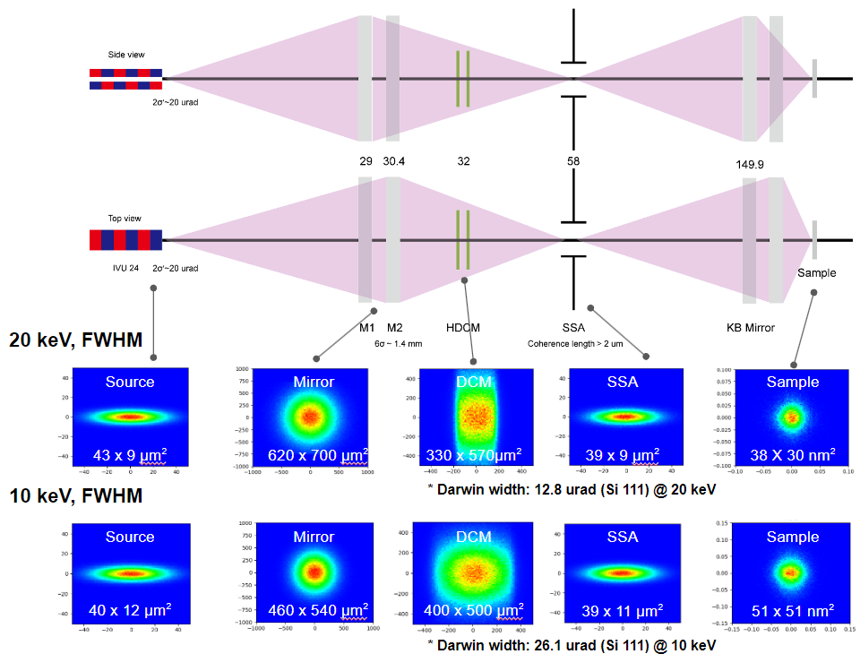

``ID10`` NanoProbe
=================================

1. Introduction
===============

2. Scientific objectives
========================

The nanoprobe beamline provides a nano-beam smaller than 50 nm in the
hard X-ray energy range of 5 to 25 keV. This beam size of 50 nm allows
for quantitative nanoscale analysis of the element distribution and
quantity of materials in localized regions. The energy range of 5 to 25
keV enables quantitative nano-spectroscopy for most transition metals
and rare earth metals. Additionally, the high penetration power of hard
X-rays can pass through gas environments and windows required for
maintaining these environments, allowing for the study of materials
under synthesis and operating conditions. To facilitate such research,
the nanoprobe beamline is designed to provide a long working distance of
50 mm despite the small beam size in the tens of nanometer range. This
makes it easy to insert devices that offer various conditions, such as
high and low temperature, gas environments, liquid environment sample
delivery, and the application of electric or magnetic fields, enabling
in-situ/operando materials research. The scientific focus of the
nanoprobe is on tracking the reactions and defect growth processes of
battery and catalyst systems, or the quantitative nanoscale analysis of
complex functional materials and material systems in actual
manufacturing and operating environments. Additionally, to accommodate
with the trend of scaling up systems by spreading and stacking
nano-components for enhanced reactivity or performance, we have
introduced high-speed precision nano-stages, allowing us to investigate
larger areas at the nanoscale. The measurement equipment includes X-ray
fluorescence detectors and signal detectors, providing quantitative
simultaneous information on the electron density, strain, and element
distribution of the sample, with all measurements designed to be studied
in three dimensions.

3. Beamline Requirements for the Insertion Device
=================================================

The nanoprobe beamline provides an energy range of 5-25 keV using an
In-Vacuum Undulator(IVU). IDs of Nanoprobe are designed to give the
highest brilliance in this range without losing energy continuity. The
parameters for the IDs are detailed in the table below. The maximum
power represents the maximum beam power passing through a mask with a 2
x 2 mm² opening @ 23 m under the maximum current conditions(400 mA)
[Table 1].

+---------+---------+---------+--------------------+--------+--------+
| **Undu  | *       | *       | **Location**       | **Max  | **Min. |
| lator** | *Period | *Length |                    | P      | Gap    |
|         | [mm]**  | [m]**   |                    | ower** | [mm]** |
+=========+=========+=========+====================+========+========+
| In      | 24      | 3.0     | Center of Straight | 0.96   | 6      |
| -vacuum |         |         | section            | kW     |        |
+---------+---------+---------+--------------------+--------+--------+

Table 1. Parameters of insertion device

4. Beamline Requirements for the Front End
==========================================

The FE of the nanoprobe beamline is required to 1) handle a 17 kW heat
load, 2) beam position diagnostics, and 3) radiation safety. First, the
17 kW total beam power generated by the IDs is managed using three masks
with water cooled channels. Two of these masks are 'Movable masks' with
adjustable gap sizes and positions, while the third is a 'Fixed mask'
with a fixed aperture size in horizontal direction that can only have
its position adjusted. For detailed specifications of the masks, refer
to Chapter []. Note that although the IDs have a minimum gap of 5 mm,
the effective minimum gap required to provide the 5-25 keV range is 6
mm. Consequently, the maximum total power of nanoprobe IDs is 12 kW.
Secondly, the FE includes an X-ray beam position diagnostic device. In
the first phase, the diagnostic X-ray beam position will be used to
provide feedback for slit and optics angles, ensuring the stability of
the beam position delivered to the sample within < 10% of the beam size.
In the mature phase, the diagnostic X-ray beam position will also be
integrated with the electron beam feedback system to enhance
performance. For detailed specifications of the diagnostic device, refer
to Chapter []. Lastly, the FE is equipped with safety devices to protect
against gamma radiation and electron beam insertion in FE. Specifically,
a safety magnet with a strength of 0.5 T is installed to handle
scenarios where the electron beam enters the FE. This ensures that any
electron beam inserted into the FE is deflected horizontally and
prevented from reaching the optical hutch.

5. Beamline Layout
==================

**Beamline layout**

The Nanoprobe beamline is one of the two “long beamlines” being
developed for the Korea-4GSR construction.

|image1|

[Figure 1] Beamline layout of Nanoprobe beamline

**Beamline component list**

+----------+--------------------------+----+--------------------------+
| Distance | Component name           | D  |                          |
| (m)      |                          | es |                          |
|          |                          | cr |                          |
|          |                          | ip |                          |
|          |                          | ti |                          |
|          |                          | on |                          |
|          |                          | /  |                          |
|          |                          | C  |                          |
|          |                          | om |                          |
|          |                          | me |                          |
|          |                          | nt |                          |
+==========+==========================+====+==========================+
| 0        | IVU24                    |    |                          |
+----------+--------------------------+----+--------------------------+
| 27.0     | Beam attenuator          | D  |                          |
|          |                          | ia |                          |
|          |                          | mo |                          |
|          |                          | nd |                          |
|          |                          | 0  |                          |
|          |                          | .5 |                          |
|          |                          | mm |                          |
|          |                          | -  |                          |
|          |                          | 3  |                          |
|          |                          | mm |                          |
|          |                          | th |                          |
|          |                          | ic |                          |
|          |                          | k, |                          |
|          |                          | S  |                          |
|          |                          | il |                          |
|          |                          | ic |                          |
|          |                          | on |                          |
|          |                          | 0  |                          |
|          |                          | .5 |                          |
|          |                          | mm |                          |
|          |                          | -  |                          |
|          |                          | 10 |                          |
|          |                          | mm |                          |
|          |                          | t  |                          |
|          |                          | hi |                          |
|          |                          | ck |                          |
+----------+--------------------------+----+--------------------------+
| 28.0     | White beam slit          | Up |                          |
|          |                          | to |                          |
|          |                          | 4  |                          |
|          |                          | k  |                          |
|          |                          | W/ |                          |
|          |                          | C  |                          |
|          |                          | en |                          |
|          |                          | tr |                          |
|          |                          | al |                          |
|          |                          | co |                          |
|          |                          | ne |                          |
|          |                          | tr |                          |
|          |                          | an |                          |
|          |                          | sf |                          |
|          |                          | er |                          |
+----------+--------------------------+----+--------------------------+
| 28.8     | Diamond screening        | Re |                          |
|          | monitor                  | so |                          |
|          |                          | lu |                          |
|          |                          | ti |                          |
|          |                          | on |                          |
|          |                          | 1  |                          |
|          |                          | um |                          |
|          |                          |    |                          |
|          |                          | D  |                          |
|          |                          | ia |                          |
|          |                          | mo |                          |
|          |                          | nd |                          |
|          |                          | t  |                          |
|          |                          | hi |                          |
|          |                          | ck |                          |
|          |                          | ne |                          |
|          |                          | ss |                          |
|          |                          | 2  |                          |
|          |                          | 00 |                          |
|          |                          | um |                          |
|          |                          |    |                          |
|          |                          | Be |                          |
|          |                          | am |                          |
|          |                          | mo |                          |
|          |                          | ni |                          |
|          |                          | to |                          |
|          |                          | ri |                          |
|          |                          | ng |                          |
+----------+--------------------------+----+--------------------------+
| 29.0     | **Horizontal high heat   | S  |                          |
|          | load mirror (Sagittal    | ph |                          |
|          | focusing)**              | er |                          |
|          |                          | ic |                          |
|          |                          | al |                          |
|          |                          | cy |                          |
|          |                          | li |                          |
|          |                          | nd |                          |
|          |                          | er |                          |
|          |                          | mi |                          |
|          |                          | rr |                          |
|          |                          | or |                          |
|          |                          |    |                          |
|          |                          | 3  |                          |
|          |                          | -s |                          |
|          |                          | tr |                          |
|          |                          | ip |                          |
|          |                          | c  |                          |
|          |                          | oa |                          |
|          |                          | ti |                          |
|          |                          | ng |                          |
|          |                          | (P |                          |
|          |                          | t, |                          |
|          |                          | R  |                          |
|          |                          | h, |                          |
|          |                          | S  |                          |
|          |                          | i) |                          |
+----------+--------------------------+----+--------------------------+
| 29.8     | Diamond screening        | Re |                          |
|          | monitor                  | so |                          |
|          |                          | lu |                          |
|          |                          | ti |                          |
|          |                          | on |                          |
|          |                          | <  |                          |
|          |                          | 1  |                          |
|          |                          | um |                          |
|          |                          | /D |                          |
|          |                          | ia |                          |
|          |                          | mo |                          |
|          |                          | nd |                          |
|          |                          | t  |                          |
|          |                          | hi |                          |
|          |                          | ck |                          |
|          |                          | ne |                          |
|          |                          | ss |                          |
|          |                          | 2  |                          |
|          |                          | 00 |                          |
|          |                          | um |                          |
+----------+--------------------------+----+--------------------------+
| 30.4     | **Horizontal mirror      | El |                          |
|          | (Tangential focusing)**  | li |                          |
|          |                          | pt |                          |
|          |                          | ic |                          |
|          |                          | al |                          |
|          |                          | cy |                          |
|          |                          | li |                          |
|          |                          | nd |                          |
|          |                          | er |                          |
|          |                          | Be |                          |
|          |                          | nd |                          |
|          |                          | ab |                          |
|          |                          | le |                          |
|          |                          | mi |                          |
|          |                          | rr |                          |
|          |                          | or |                          |
|          |                          |    |                          |
|          |                          | 2  |                          |
|          |                          | -s |                          |
|          |                          | tr |                          |
|          |                          | ip |                          |
|          |                          | c  |                          |
|          |                          | oa |                          |
|          |                          | ti |                          |
|          |                          | ng |                          |
|          |                          | (P |                          |
|          |                          | t, |                          |
|          |                          | R  |                          |
|          |                          | h, |                          |
|          |                          | S  |                          |
|          |                          | i) |                          |
+----------+--------------------------+----+--------------------------+
| 31.0     | White beam diamond beam  | Re |                          |
|          | position monitor         | so |                          |
|          |                          | lu |                          |
|          |                          | ti |                          |
|          |                          | on |                          |
|          |                          | be |                          |
|          |                          | am |                          |
|          |                          | si |                          |
|          |                          | ze |                          |
|          |                          | <  |                          |
|          |                          | 0. |                          |
|          |                          | 1% |                          |
|          |                          |    |                          |
|          |                          | /  |                          |
|          |                          | Be |                          |
|          |                          | am |                          |
|          |                          | po |                          |
|          |                          | si |                          |
|          |                          | ti |                          |
|          |                          | on |                          |
|          |                          | m  |                          |
|          |                          | on |                          |
|          |                          | it |                          |
|          |                          | or |                          |
|          |                          | a  |                          |
|          |                          | nd |                          |
|          |                          | be |                          |
|          |                          | am |                          |
|          |                          | po |                          |
|          |                          | si |                          |
|          |                          | ti |                          |
|          |                          | on |                          |
|          |                          | fe |                          |
|          |                          | ed |                          |
|          |                          | ba |                          |
|          |                          | ck |                          |
|          |                          | wi |                          |
|          |                          | th |                          |
|          |                          | mi |                          |
|          |                          | rr |                          |
|          |                          | or |                          |
|          |                          | sy |                          |
|          |                          | st |                          |
|          |                          | em |                          |
+----------+--------------------------+----+--------------------------+
| 32.0     | DCM                      | HD |                          |
|          |                          | CM |                          |
|          |                          |    |                          |
|          |                          | Of |                          |
|          |                          | fs |                          |
|          |                          | et |                          |
|          |                          | <  |                          |
|          |                          | 10 |                          |
|          |                          | mm |                          |
+----------+--------------------------+----+--------------------------+
| 35.0     | Diamond beam position    | Re |                          |
|          | monitor                  | so |                          |
|          |                          | lu |                          |
|          |                          | ti |                          |
|          |                          | on |                          |
|          |                          | be |                          |
|          |                          | am |                          |
|          |                          | si |                          |
|          |                          | ze |                          |
|          |                          | <  |                          |
|          |                          | 0. |                          |
|          |                          | 1% |                          |
|          |                          |    |                          |
|          |                          | /  |                          |
|          |                          | Be |                          |
|          |                          | am |                          |
|          |                          | po |                          |
|          |                          | si |                          |
|          |                          | ti |                          |
|          |                          | on |                          |
|          |                          | m  |                          |
|          |                          | on |                          |
|          |                          | it |                          |
|          |                          | or |                          |
|          |                          | a  |                          |
|          |                          | nd |                          |
|          |                          | be |                          |
|          |                          | am |                          |
|          |                          | po |                          |
|          |                          | si |                          |
|          |                          | ti |                          |
|          |                          | on |                          |
|          |                          | fe |                          |
|          |                          | ed |                          |
|          |                          | ba |                          |
|          |                          | ck |                          |
|          |                          | wi |                          |
|          |                          | th |                          |
|          |                          | mi |                          |
|          |                          | rr |                          |
|          |                          | or |                          |
|          |                          | sy |                          |
|          |                          | st |                          |
|          |                          | em |                          |
+----------+--------------------------+----+--------------------------+
| 57.0     | Nanobeam position        | Re |                          |
|          | monitor and screening    | so |                          |
|          |                          | lu |                          |
|          |                          | ti |                          |
|          |                          | on |                          |
|          |                          | 1  |                          |
|          |                          | 00 |                          |
|          |                          | nm |                          |
|          |                          |    |                          |
|          |                          | ta |                          |
|          |                          | rg |                          |
|          |                          | et |                          |
|          |                          | a  |                          |
|          |                          | ng |                          |
|          |                          | le |                          |
|          |                          | re |                          |
|          |                          | so |                          |
|          |                          | lu |                          |
|          |                          | ti |                          |
|          |                          | on |                          |
|          |                          | <  |                          |
|          |                          | 10 |                          |
|          |                          | n  |                          |
|          |                          | mr |                          |
|          |                          | ad |                          |
+----------+--------------------------+----+--------------------------+
| 58.0     | Secondary source         | G  |                          |
|          | aperture (Precision      | ap |                          |
|          | slit)                    | re |                          |
|          |                          | so |                          |
|          |                          | lu |                          |
|          |                          | ti |                          |
|          |                          | on |                          |
|          |                          | ~  |                          |
|          |                          | 1  |                          |
|          |                          | 00 |                          |
|          |                          | nm |                          |
|          |                          | /  |                          |
|          |                          | M  |                          |
|          |                          | in |                          |
|          |                          | im |                          |
|          |                          | um |                          |
|          |                          | g  |                          |
|          |                          | ap |                          |
|          |                          | 1  |                          |
|          |                          | um |                          |
+----------+--------------------------+----+--------------------------+
| 137.0    | **Beam position          | D  |                          |
|          | monitor**                | ia |                          |
|          |                          | mo |                          |
|          |                          | nd |                          |
|          |                          | sc |                          |
|          |                          | re |                          |
|          |                          | en |                          |
|          |                          | mo |                          |
|          |                          | ni |                          |
|          |                          | to |                          |
|          |                          | r, |                          |
|          |                          | 1  |                          |
|          |                          | um |                          |
|          |                          | r  |                          |
|          |                          | es |                          |
|          |                          | ol |                          |
|          |                          | ut |                          |
|          |                          | io |                          |
|          |                          | n, |                          |
|          |                          | R  |                          |
|          |                          | em |                          |
|          |                          | ov |                          |
|          |                          | ab |                          |
|          |                          | le |                          |
+----------+--------------------------+----+--------------------------+
| 138.0    | Endstation 1             |    |                          |
+----------+--------------------------+----+--------------------------+
| 147.0    | **Beam position          | D  |                          |
|          | monitor**                | ia |                          |
|          |                          | mo |                          |
|          |                          | nd |                          |
|          |                          | sc |                          |
|          |                          | re |                          |
|          |                          | en |                          |
|          |                          | mo |                          |
|          |                          | ni |                          |
|          |                          | to |                          |
|          |                          | r, |                          |
|          |                          | 1  |                          |
|          |                          | um |                          |
|          |                          | r  |                          |
|          |                          | es |                          |
|          |                          | ol |                          |
|          |                          | ut |                          |
|          |                          | io |                          |
|          |                          | n, |                          |
|          |                          | R  |                          |
|          |                          | em |                          |
|          |                          | ov |                          |
|          |                          | ab |                          |
|          |                          | le |                          |
+----------+--------------------------+----+--------------------------+
| 148.0    | Ion gas chamber          |    |                          |
+----------+--------------------------+----+--------------------------+
| 149.0    | **KB mirror slit**       | 4  |                          |
|          |                          | -w |                          |
|          |                          | ay |                          |
|          |                          | Sl |                          |
|          |                          | it |                          |
|          |                          | s, |                          |
|          |                          | HV |                          |
|          |                          | /  |                          |
|          |                          | Re |                          |
|          |                          | mo |                          |
|          |                          | ve |                          |
|          |                          | p  |                          |
|          |                          | ar |                          |
|          |                          | as |                          |
|          |                          | it |                          |
|          |                          | ic |                          |
|          |                          | sc |                          |
|          |                          | at |                          |
|          |                          | te |                          |
|          |                          | ri |                          |
|          |                          | ng |                          |
+----------+--------------------------+----+--------------------------+
| 149.5    | KB mirror and chamber    | H: |                          |
|          |                          | 3  |                          |
|          |                          | 00 |                          |
|          |                          | m  |                          |
|          |                          | m, |                          |
|          |                          | V: |                          |
|          |                          | 1  |                          |
|          |                          | 00 |                          |
|          |                          | m  |                          |
|          |                          | m, |                          |
|          |                          | P  |                          |
|          |                          | t, |                          |
|          |                          | Rh |                          |
|          |                          | c  |                          |
|          |                          | oa |                          |
|          |                          | ti |                          |
|          |                          | ng |                          |
|          |                          |    |                          |
|          |                          | In |                          |
|          |                          | ci |                          |
|          |                          | de |                          |
|          |                          | nt |                          |
|          |                          | an |                          |
|          |                          | gl |                          |
|          |                          | e: |                          |
|          |                          | 3  |                          |
|          |                          | mr |                          |
|          |                          | ad |                          |
+----------+--------------------------+----+--------------------------+
| 150.0    | Endstation 2             |    |                          |
+----------+--------------------------+----+--------------------------+

[Table 2] Major component list of Nanoprobe beamline

6. Optics Overview
==================

In this section, we describe the optics and beam specifications of the
nanoprobe beamline. For parameters related to the electron beam, refer
to the chapter []. All optical simulations were performed in ShadowOui
with the OASYS environment. The simulations for the optical components
were primarily conducted at 10 keV, which is expected to be frequently
used, and also at 20 keV for comparison. Note that the beam source
parameters provided by the OASYS environment do not take into account
the electron energy dispersion. This means that at high energies (high
harmonics), the divergence angle of the beam is more than twice that of
the diffraction limit. Therefore, we use the source parameters provided
by SPECTRA as a Geometry source in OASYS. Also, the coherent length (BDA
size) and coherent flux calculations were conducted using homemade code
in the Matlab environment.

**Beam specification**

+-------------+---------------------------+---------------------------+
| **Energy**  | **BDA-V**                 | **BDA-H**                 |
+=============+===========================+===========================+
| 10 keV      | 2.6 µm                    | 2.5 µm                    |
+-------------+---------------------------+---------------------------+
| 20 keV      | 1.6 µm                    | 1.5 µm                    |
+-------------+---------------------------+---------------------------+

[Table 3] The coherence length at the BDA.

[Table 3] shows the coherence length at 10 keV and 20 keV. This
represents the coherence size of the beam focused at the BDA position,
which is a crucial factor for coherence diffraction(scattering)
experiments (e.g., Ptychography, XPCS). [Table 4] shows the coherence
fraction, which is the ratio of the total flux to the coherent flux in a
mono beam (0.01% Bandwidth). Where coherent flux is the flux passing
through the BDA when it is opened to the coherence length. [Figure 2]
shows the expected coherent flux delivered to the sample, taking into
account mirror reflectivity, number of reflections, BDA size, angular
acceptance of the nanofocusing optics, and the polarization effect of
the HDCM.

+---------+-------------------+-------------------+-------------------+
| **E     | **Coherent flux   | **Total flux      | **Coherent        |
| nergy** | (phs/s/0.01%)**   | (phs/s/0.01%)**   | fraction**        |
+=========+===================+===================+===================+
| 10 keV  | 4.85 x            | 7.42 x            | 6.5 %             |
|         | 10\ :sup:`12`     | 10\ :sup:`13`     |                   |
+---------+-------------------+-------------------+-------------------+
| 20 keV  | 4.03 x            | 2.85 x            | 1.4 %             |
|         | 10\ :sup:`11`     | 10\ :sup:`13`     |                   |
+---------+-------------------+-------------------+-------------------+

[Table 4] Flux and coherent fraction.

|image2|

[Figure 2] Coherent flux @ sample position

**Consideration for optical layout**

|image3|

[Figure 3] Optical layout of Nanoprobe beamline. M1(High heat load
mirror, Sagittal focusing) and M2(High heat load mirror, Bendable,
meridional focusing) are horizontally reflecting mirrors. HDCM is
Horizontal deflecting Double Crystal Monochromator. SSA is a secondary
source aperture, also called a Beam defining aperture (BDA).

[Figure 3] shows the optical layout of the nanoprobe beamline. The
ultimate goal in designing the layout and specifications of the optical
components is to keep the beam instability delivered to the sample below
10%. To achieve this, we are considering two main aspects. First, the
beamline layout of the nanoprobe beamline incorporates a secondary
source focusing method that enables a flux-versus-resolution trade-off
using the BDA. The optimal position for the BDA is determined by the
coherence length at the BDA position. An optical design with a high
magnification ratio at the BDA allows for a shorter beamline with lower
construction costs. However, the engineering challenge lies in making
controllable apertures smaller than a micrometer. [Table 5] shows the
coherence length and RMS beam size at the BDA for different
magnification ratios. A magnification ratio of approximately 1:1
provides a controllable aperture size. The first optics after the
shielding wall is 29 m from the source, and thus BDA optimal position is
58 m.

+---------+---------------------+------------+------------+------------+
| **E     | **Magnification**   | **2:1**    | **1:1**    | **1:2**    |
| nergy** |                     |            |            |            |
+=========+=====================+============+============+============+
| 10 keV  | Coherence length (H | 1.28 x     | 2.5 x 2.6  | 3.9 x 4.0  |
|         | x V, um)            | 1.34       |            |            |
+---------+---------------------+------------+------------+------------+
|         | RMS beam size (H x  | 9.8 x 2.3  | 19.0 x 4.5 | 29.4 x 7.0 |
|         | V, um)              |            |            |            |
+---------+---------------------+------------+------------+------------+
| 20 keV  | Coherence length (H | 0.77 x     | 1.5 x 1.6  | 2.3 x 2.5  |
|         | x V, um)            | 0.84       |            |            |
+---------+---------------------+------------+------------+------------+
|         | RMS beam size (H x  | 9.8 x 2.2  | 18.9 x 4.2 | 29.3 x 6.5 |
|         | V, um)              |            |            |            |
+---------+---------------------+------------+------------+------------+

[Table 5] The coherence length and RMS beam size at the BDA for
different magnification ratios.

Second, the design ensures that the beam's peak heat density on the DCM
is kept below 40 W/mm². This is to prevent thermal bumps and damage to
the first crystal. To reduce the heat density, beamlines of Korea-4GSR
adopt two strategies. The first is to locate the DCM crystal more than
50 m away from the source. This approach minimizes the number of optical
components. This prevents wavefront distortion caused by imperfections
of mirror surface and beam instability caused by optics vibrations.
However, this strategy cannot optimize the beam flux, because it can
only obtain to not cause thermal bump. The second strategy uses mirrors
to absorb the heat load. This has the drawback of needing to correct the
thermal bump caused by the heat load [Figure 4]. But, this approach can
provide high beam flux above 10\ :sup:`12` phs/s (Coherence flux:
>10\ :sup:`11` phs/s @ 10 keV). We have chosen the second strategy to
provide optimized high beam flux.

|image4|

[Figure 4] Mirror surface profile caused by thermal bumps on the M1
mirror. Bend M2 to correct the focused beam size at the BDA to be closer
to the ideal size.

**Optics Specification**

+------------------+----------------+----------------+----------------+
|                  | **M1**         | **M2**         | **DCM**        |
+==================+================+================+================+
| Source to sample | 29             | 30.4           | 32             |
| distance (m)     |                |                |                |
+------------------+----------------+----------------+----------------+
| Incident Angle   | 2.5 mrad       | 2.5 mrad       | 3 ~ 45 degree  |
+------------------+----------------+----------------+----------------+
| Shape            | Fixed          | Bendable       | Plane          |
|                  | spherical      | spherical      |                |
|                  | cylinder       | cylinder       |                |
+------------------+----------------+----------------+----------------+
| Radius (mm)      | Rs : 72.5 / Rm | 11.6 km        | Inf            |
|                  | : > 100 km     |                |                |
+------------------+----------------+----------------+----------------+
| Direction        | Horizontal     | Horizontal     | Horizontal     |
+------------------+----------------+----------------+----------------+
| Substrate        | Si             | Si             | Si             |
+------------------+----------------+----------------+----------------+
| Coating Material | Pt (40 nm)     | Si, Pt (40 nm) | -              |
+------------------+----------------+----------------+----------------+
| Mirror size (H × | 400 x 30       | 400 x 30       | -              |
| V, mm × mm)      |                |                |                |
+------------------+----------------+----------------+----------------+
| Focal length     | 29,000         | 27,600         | Inf            |
| (mm)             |                |                |                |
+------------------+----------------+----------------+----------------+
| Roughness σ (nm) | < 0.3          | < 0.3          | < 1            |
+------------------+----------------+----------------+----------------+
| Slope error      | < 0.2          | < 0.2          | < 1            |
| (μrad, RMS)      |                |                |                |
+------------------+----------------+----------------+----------------+
| Max total heat   | 36.4           | 20.6           | 102            |
| load (W)         |                |                |                |
+------------------+----------------+----------------+----------------+
| Max surface head | 0.093          | 0.016          | < 40           |
| load             |                |                |                |
| (W/mm\ :sup:`2`) |                |                |                |
+------------------+----------------+----------------+----------------+

[Table 6] KB mirror specification

[Table 6] lists the specifications of the mirrors used in the nanoprobe
beamline. The specifications of the M1 and M2 mirrors are designed to
focus the beam on the BDA located at 58 m. The slope error tolerance is
set to ensure that the beam broadens below 10%. The M3 mirror is a
Nano-KB mirror designed to produce a beam of <50 nm at energies above 8
keV. The M3 mirror also has less than 10% beam broadening with its set
slope error tolerance. [Figure 5] shows the results of optical
simulations that meet these tolerances.

[Figure 5] Effects of KB mirror slope eros on the focused beam.

