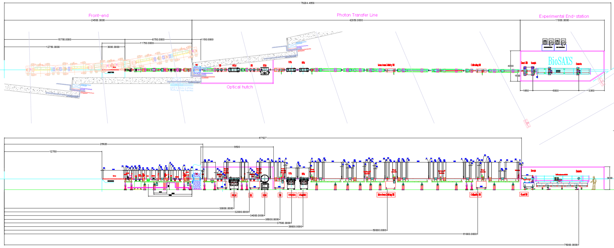
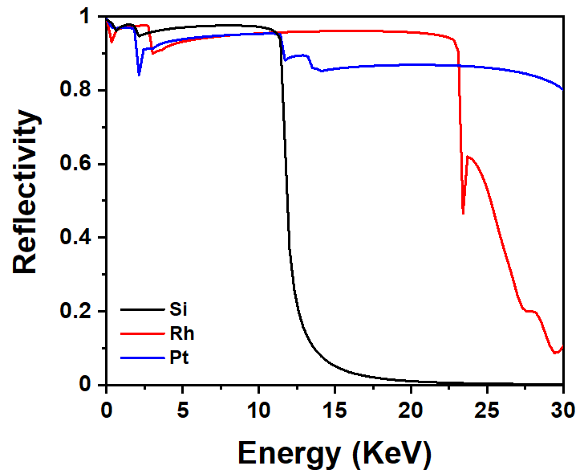
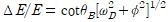

``ID21`` BioPharma-BioSAXS (BioSAXS)
=================================

1. Introduction
===============

The BioPharma-BioSAXS beamline performs overall structural
characterization and structural transition studies of biological
molecules in solution based on small angle X-ray scattering (SAXS)
technique.[1, 2] SAXS measurement of samples in solution can obtain
information with a resolution as low as 1-2 nm. It can be applied to a
unique physiological solution environment where the physiological
phenomena of biological molecules can be activated. It is possible to
analyze the structural characteristics of crystalline/non-crystalline
biological molecules under physiological conditions and conduct
structural stability and structural transition studies under various
experimental environmental conditions (temperature, pressure, pH,
UV/Visible, ionic strength, ligand, electric field, magnetic field,
etc.). Due to these advantages, the usability of the solution SAXS
technique has greatly increased along with high-resolution structural
analysis methods of biological molecules such as X-ray crystallography,
nuclear magnetic resonance spectroscopy, and cryo-electron
microscopy.[3] As a result, solution SAXS technique is being used as a
standard analysis technique for structural characterization from
biological molecules to nanostructure systems such as organic/inorganic
nanoparticles, polymers, liquid crystals, colloids, and metals. Over the
past 10 years, a dedicated BioSAXS beamline has been built at a
world-class synchrotron radiation facility, contributing widely to the
development of basic and applied science fields such as nanoresearch,
structural biology, medicine, and new drug development. Recently, the
biopharmaceutical field has begun to include the BioSAXS analysis
technique in the workflow for analyzing the characteristics of
biopharmaceutical for the purpose of identifying the structure,
function, and operating principle of bio/protein therapeutics and
providing evidence to prove the biological equivalence of biosimilars
compared to original biopharmaceuticals. The BioPharma-BioSAXS beamline
is classified and constructed as an industry priority support beamline
to respond to the demands of industries in the bio and pharmaceutical
fields and to promote manpower in related fields. The main strategy of
the beamline is to process a large number of samples at high speed
(high-throughput) in order to efficiently utilize high brilliance and
low divergence X-rays based on 4th generation synchrotron radiation.[4]

2. Scientific objectives
========================

The BioPharma-BioSAXS beamline provides a solution SXAS technique,
contributing to the analysis of biopharmaceutical properties by studying
the three-dimensional structure and structural transition of
solution-phase biological molecules and their complexes. Examples of
applications using the solution SAXS technique are as follows: (1)
Quantitatively characterize the structure of multi-domain proteins
linked by flexible linkers and intrinsically disordered proteins.[5-8]
(2) Reveal the structural behavior and stability of proteins and protein
drugs through understanding the structure of the native and denatured
states of proteins.[9-11] (3) Recently, mRNA vaccines and treatments
have been in the spotlight, and lipid nanoparticles (LNPs) are being
used as an effective mRNA delivery system, and the structural stability
of mRNA-LNPs in solution is being studied.[12, 13] (4) Real-time
SEC-SAXS technique is used to study the change in solution phase
structure of monodisperse biopolymer materials through
separation/purification.[14] To facilitate such research, a collimated
beam with high beam flux must be irradiated onto the sample. Varying the
SDD is essential due to the diversity of samples to be measured and the
need for a wide q range. A variable q range vacuum chamber will be built
for fast and precise SDD change (0.5 - 6 m). By introducing an automatic
sample changer at a fixed sample environment location, large number of
samples can be processed at high speed to collect data at high
throughput.

3. Beamline Requirements for the Insertion Device
=================================================

The BioPharma-BioSAXS beamline will require the highest brilliance in
the energy range of 5-20 keV without energy discontinuity. The source
will be in-vacuum undulator with period length of 24 mm and total length
of 3 m. A detailed description of the BioPharma-BioSAXS Insertion Device
can be found in the [].

**Table 1**. Source Parameter for BioPharma-BioSAXS beamline

+-------+-----+-----+----+-----+-----+----------+---------------------+
| Undu  | Per | Len | U  | K   | Po  | Power    | Max. power after FE |
| lator | iod | gth | \  | \ : | wer | density  |                     |
|       |     |     | :s | sub |     |          | (kW)                |
|       | (   | (m) | ub | :`m | (   | (kW      |                     |
|       | mm) |     | :` | ax` | kW) | mrad\ :s |                     |
|       |     |     | g` |     |     | up:`-2`) |                     |
|       |     |     |    |     |     |          |                     |
|       |     |     | (m |     |     |          |                     |
|       |     |     | m) |     |     |          |                     |
+=======+=====+=====+====+=====+=====+==========+=====================+
| IVU24 | 24  | 3   | 5- | 2.  | 1   | 165      | 0.87                |
|       |     |     | 16 | 747 | 7.9 |          |                     |
|       |     |     |    |     |     |          | Through 2(h)×2(v)   |
|       |     |     |    |     |     |          | mm\ :sup:`2` FE     |
|       |     |     |    |     |     |          | mask                |
+-------+-----+-----+----+-----+-----+----------+---------------------+

4. Beamline Requirements for the Front End
==========================================

The front end of BioPharma-BioSAXS beamline will require to handle a
maximum power of 17.9 kW. The output of the beam from IVU24 is
appropriately attenuated using three masks in the front end to prevent
damage to the optical devices in the PTL section and enable stable
operation of the beam line. The BioPharma-BioSAXS beamline will utilize
the standard KOREA-4GSR IVU24 front end design. Two fixed type masks and
one movable type mask will control a total of 17.5 kW of heat at the
front end. The beamsize drawn from the front end will be 1.3 x 1.3 mm²
at front end exit port. A detailed description of the BioPharma-BioSAXS
Front End can be found in the [].

5. Beamline Layout
==================

The BioPharma-BioSAXS beamline is a SAXS-dedicated beamline at the
KOREA-4GSR construction. The beamline layout is shown in Figure 1, where
the beamline will consist of a front end, an optical hutch, a photon
transfer line, and an experimental hutch.

|image1|

**Figure 1**. Layout of BioPharma-BioSAXS beamline

Table 2 shows major beamline components, their location along the
beamline, and description.

**Table 2**. List of BioPharma-BioSAXS beamline component

+------------+--------------+----------------+-------------------------+
| **Distance | *            | *              | **Comments**            |
| from       | *Component** | *Description** |                         |
| source     |              |                |                         |
| (m)**      |              |                |                         |
+============+==============+================+=========================+
| 27.7       | Attenuator   | Water cooled,  | Removing low energy     |
|            |              | CVD diamond,   | X-ray beam              |
|            |              | B              |                         |
|            |              | \ :sub:`4`\ C, |                         |
|            |              | Si             |                         |
+------------+--------------+----------------+-------------------------+
| 28.3       | Slit         | Water cooled,  | Eliminating heat load   |
|            |              | 4-way slit,    |                         |
|            |              | UHV            | Mirror incident X-ray   |
|            |              |                | conditioning            |
+------------+--------------+----------------+-------------------------+
| 28.8       | Diagnostic   | W-blade BPM    | Beam position & profile |
|            |              |                | defining                |
+------------+--------------+----------------+-------------------------+
| 30.0       | HHLM         | Flat mirror    | Eliminating heat load   |
|            |              |                | from X-ray              |
|            | (High heat   | 2-stripe       |                         |
|            | load mirror) | coating (Pt,   |                         |
|            |              | Rh)            |                         |
+------------+--------------+----------------+-------------------------+
| 32.2       | Slit         | 4-way slit,    | Beam conditioning       |
|            |              | UHV            |                         |
+------------+--------------+----------------+-------------------------+
| 33.1       | Diagnostic   | W-blade BPM    | Beam position & profile |
|            |              |                | defining                |
+------------+--------------+----------------+-------------------------+
| 34.0       | DCM          | Si (111),      | Monochromatizating      |
|            |              | fixed exit,    | X-ray beam              |
|            | (Double      | NL\ :sub:`2`   |                         |
|            | crystal      | cooled         |                         |
|            | mo           |                |                         |
|            | nochromator) |                |                         |
+------------+--------------+----------------+-------------------------+
| 35.9       | Slit         | 4-way slit,    | Beam conditioning       |
|            |              | UHV            |                         |
+------------+--------------+----------------+-------------------------+
| 36.3       | Diagnostic   | YAG + CCD      | Beam position & profile |
|            |              |                | defining                |
+------------+--------------+----------------+-------------------------+
| 37.4       | VFM          | Ellipsoid      | Focusing the beam in    |
|            |              |                | vertical direction      |
|            | (Vertical    | Rh, PT coating |                         |
|            | Focusing     |                |                         |
|            | Mirror)      |                |                         |
+------------+--------------+----------------+-------------------------+
| 39.1       | HFM          | Ellipsoid      | Focusing the beam in    |
|            |              |                | horizontal direction    |
|            | (Horizontal  | Rh, PT coating |                         |
|            | Focusing     |                |                         |
|            | Mirror)      |                |                         |
+------------+--------------+----------------+-------------------------+
| 50.0       | Slit         | 4-way slit, HV | Monochromatic beam      |
|            |              |                | conditioning            |
+------------+--------------+----------------+-------------------------+
| 50.9       | Diagnostic   | YAG + CCD      | Beam position & profile |
|            |              |                | defining                |
+------------+--------------+----------------+-------------------------+
| 57.0       | Diagnostic   | OFHC + YAG     | Beam position & profile |
|            |              |                | defining                |
+------------+--------------+----------------+-------------------------+
| 61.8       | Slit         | 4-way slit, HV | Monochromatic beam      |
|            |              |                | collimation             |
+------------+--------------+----------------+-------------------------+
| 62.5       | Diagnostic   | YAG + CCD      | Beam position & profile |
|            |              |                | defining                |
+------------+--------------+----------------+-------------------------+
| 67.1       | Shutter      | W              | Blocking the beam       |
+------------+--------------+----------------+-------------------------+
| 68.0       | Slit         | 4-way slit, HV | Parasitic beam          |
|            |              |                | rejection               |
+------------+--------------+----------------+-------------------------+
| 69.0       | Sample       | ARINAX robot   | Automatic sample        |
|            | environment  |                | exchanging system       |
+------------+--------------+----------------+-------------------------+
| 69.3~75.8  | Variable     | 7 m long       | Detector position in    |
|            | *q*-range    |                | vacuum tube             |
|            | vacuum       | SDD 0.5~6.0 m  |                         |
|            | chamber      |                | SDD adjustment          |
+------------+--------------+----------------+-------------------------+
| 69.5~75    | 2D detector  | Eiger2 X 4M    | Scattering pattern      |
|            |              |                | detection               |
+------------+--------------+----------------+-------------------------+

6. Optics Overview 
===================

**6.1 Mirror Specifications**

Table 3 shows detailed specifications for optics.

**Table 3**. Specification for BioPharma-BioSAXS beamline optics

+----------------+-----------------+-----------------+-----------------+
| **Property**   | **M1**          | **M2**          | **M3**          |
+================+=================+=================+=================+
| Mirror system  | HHLM            | VFM             | HFM             |
| type           |                 |                 |                 |
+----------------+-----------------+-----------------+-----------------+
| Mirror size    | 50 x 800 x 50   | 50 x 500 x 50   | 50 x 500 x 50   |
|                |                 |                 |                 |
| (W x L x D,    |                 |                 |                 |
| mm)            |                 |                 |                 |
+----------------+-----------------+-----------------+-----------------+
| Optical        | 1.5 x 548       | 1.08 x 392      | 1.06 x 433      |
| footprint      |                 |                 |                 |
|                | (4 sigma)       | (FWHM)          | (FWHM)          |
| (W x L, mm)    |                 |                 |                 |
+----------------+-----------------+-----------------+-----------------+
| Coating strip  | 2 ea            | 2 ea            | 2 ea            |
| number         |                 |                 |                 |
+----------------+-----------------+-----------------+-----------------+
| Coating strip  | 10 X 800        | 10 X 500        | 10 X 500        |
| size           |                 |                 |                 |
|                |                 |                 |                 |
| (W x L, mm)    |                 |                 |                 |
+----------------+-----------------+-----------------+-----------------+
| Beam size      | 1.43 X 1.49     | 1.02 X 1.08     | 1.06 X 1.13     |
|                |                 |                 |                 |
| (V X H)        | (4 sigma)       | (FWHM)          | (FWHM)          |
+----------------+-----------------+-----------------+-----------------+
| Coating        | Rh, Pt          | Rh, Pt          | Rh, Pt          |
| material       |                 |                 |                 |
+----------------+-----------------+-----------------+-----------------+
| Substrate      | Silicon         | Silicon         | Silicon         |
| material       |                 |                 |                 |
+----------------+-----------------+-----------------+-----------------+
| Mirror surface | Plane           | Ellipsoid       | Ellipsoid       |
| shape          |                 |                 |                 |
+----------------+-----------------+-----------------+-----------------+
| Reflection     | Up              | Down            | Ring            |
| direction      |                 |                 |                 |
+----------------+-----------------+-----------------+-----------------+
| Cooling method | Eutectic bath   | No              | No              |
+----------------+-----------------+-----------------+-----------------+
| Mirror bender  | Yes             | No              | No              |
+----------------+-----------------+-----------------+-----------------+
| Tangential     | 20 km           | Ra=34137.5,     | Ra=34775,       |
| radius         |                 | Rb=88.224       | Rb=89.7451      |
|                |                 |                 |                 |
| (mm)           |                 |                 |                 |
+----------------+-----------------+-----------------+-----------------+
| Sagittal       | -               | -               | -               |
| radius         |                 |                 |                 |
|                |                 |                 |                 |
| (mm)           |                 |                 |                 |
+----------------+-----------------+-----------------+-----------------+
| Tangential     | < 0.2           | < 0.2           | < 0.2           |
| slope error    |                 |                 |                 |
|                |                 |                 |                 |
| (μrad)         |                 |                 |                 |
+----------------+-----------------+-----------------+-----------------+
| Sagittal slope | -               | -               | -               |
| error          |                 |                 |                 |
+----------------+-----------------+-----------------+-----------------+
| Incident angle | 2.6             | 2.6             | 2.6             |
|                |                 |                 |                 |
| (mrad)         |                 |                 |                 |
+----------------+-----------------+-----------------+-----------------+
| Sample beam    | 32 X 9          | 32 X 9          | 32 X 9          |
| size           |                 |                 |                 |
|                |                 |                 |                 |
| (H X V, μm)    |                 |                 |                 |
+----------------+-----------------+-----------------+-----------------+
| Shot beam      | 1 μm / 30 min   | 1 μm / 30 min   | 1 μm / 30 min   |
| stability      |                 |                 |                 |
+----------------+-----------------+-----------------+-----------------+
| Mirror surface | 1400.0          | 1464.0          | 1464.0          |
| height         |                 |                 |                 |
|                |                 |                 |                 |
| (mm)           |                 |                 |                 |
+----------------+-----------------+-----------------+-----------------+
| Motor axis     | pitch, roll, x, | pitch, roll,    | pitch, roll,    |
|                | y               | yaw, x, y, z    | yaw, x, y       |
+----------------+-----------------+-----------------+-----------------+
| Manual axis    | pitch, roll,    | pitch, roll,    | pitch, roll,    |
|                | yaw, x, y, z    | yaw, x, y, z    | yaw, x, y, z    |
+----------------+-----------------+-----------------+-----------------+
| Installation   | 30              | 37.5            | 39              |
| location       |                 |                 |                 |
|                |                 |                 |                 |
| (m)            |                 |                 |                 |
+----------------+-----------------+-----------------+-----------------+
| Max. total     | 158.8           | -               | -               |
| heat load      |                 |                 |                 |
|                |                 |                 |                 |
| (W)            |                 |                 |                 |
+----------------+-----------------+-----------------+-----------------+
| Max. surface   | 0.216           | -               | -               |
| heat load      |                 |                 |                 |
|                | @ 4 keV         |                 |                 |
| (W             |                 |                 |                 |
| /mm\ :sup:`2`) |                 |                 |                 |
+----------------+-----------------+-----------------+-----------------+

|image2|

**Figure 2**. Reflectivity of Si, Rh, Pt surface at 2.6 mrad of
incidence angle

**6.2 High Heat Load Mirror**

A high heat load mirror (HHLM) will be located 30 m from the light
source. This mirror receives the beam from the front end and reflects it
in the vertical direction. The beam in the high photon energy is
absorbed, lowering the heat load on the monochromator crystal of the
double crystal monochromator (DCM) located behind it. BioPharma-BioSAXS
beamline will use silicon (Si), rhodium (Rh), and platinum (Pt) mirror
surfaces depending on the beam energy to be used. This mirror is coated
with two lines of rhodium and platinum on a single silicon substrate,
and the uncoated side is used as a Si mirror surface. The beam incidence
angle of the mirror surface is 2.6 mrad, and Figure 2 shows the
reflectivity of each mirror surface material. The Si mirror surface
absorbs beams above 12 keV and reduces the thermal load on the DCM
crystal surface. Because high reflectivity (> 0.9) occurs in the 5 to 10
keV region, a Si mirror surface is used when using beams in this region.
According to a similar principle, the Rh-coated side is used when using
a beam in the 10 to 20 keV range, and the Pt-coated side is used when
using a beam of 20 keV or higher.

The specifications of HHLM are listed in Table 3. When the white beam
size is 1.43 mm X 1.49 mm (V x H) and incident angle is 2.6 mrad on
HHLM, the foot print is 1.5 mm x 548 mm. The size of the coating surface
is set to 10 mm x 800 mm to accommodate the entire incident beam. The
amount of heat absorbed by the mirror surface was predicted using the
SRW code in OASYS. The maximum total heat output was calculated to be
158.791 W, and the maximum heat output was calculated to be 0.216
W/mm\ :sup:`2`. The silicon substrate size of the mirror is 50 mm x 800
mm x 50 mm. The shape uses a cooling method using indium foil, Cu pad,
and cooper pipe by digging a notch groove on the side of the mirror.

**6.3 Focusing mirrors**

To focus the beam at the sample location, place a vertical focusing
mirror (VFM) at 37.5 m from the light source and a horizontal focusing
mirror (HFM) at 39 m. Both of these mirror devices are curved in the
beam direction (tangential ellipse). The beam is focused at 69 m, which
is the sample location, and the distance between the focusing positions
from the focusing mirror is 31.5 m for VFM and 30 m for HFM. As with
HHLM, the incident angle is set to 2.6 mrad, and two lines of Rh and Pt
coating are applied, respectively. Through this, harmonics are removed
once more. <Table 2.2.1.8> shows the specifications of the beam focusing
mirror device. The size of the focused beam at the sample location of 69
m is 31 μm horizontally and 9 μm vertically at half maximum.

**6.4 Double Crystal Monochromator (DCM)**

The double crystal monochromator (DCM) for monochromator adopts a
structure that reflects the beam in the vertical direction, and the
monochromator crystal uses silicon with a (111) reflection surface.
Since the vertical beam spread of the incident light in the 5-20 keV
range is less than 15 μrad, the resolution (ΔE/E) of the monochromatic
photon energy is expected to be less than 2.0×10\ :sup:`-4`. The
resolution of DCM was calculated by the following equation.

|DRW00003e20225f|

where, *θ*\ :sub:`B` is the Bragg angle (or beam incidence angle) of the
first DCM crystal, *ω*\ :sub:`D` is the Darwin width of the Si crystal,
and *ϕ* is the beam spread angle.

The tilt of the crystal (pitch angle or pitch) is adjusted in the range
of 5.7-23.3° to meet the photon energy range of 5-20 keV. The size of
the incident beam is 1.5 mm in the horizontal direction x 1.5 mm in the
vertical direction. To accommodate the beam in the entire photon energy
range, the size of the first crystal is 60 mm x 25 mm, and the second
crystal receives the beam reflected from the first crystal. The length
is set to 150 mm so that the step can be maintained at 25 mm while
accommodating it. To precisely control the direction of the emitted
light, the pitch angle and roll angle of the second crystal are driven
by a piezoelectric actuator. Changes in the position of DCM emitted
light are checked in the diagnostic device UHV-QPBM, and a feedback
system is configured to keep the beam position constant.

Table x. specification of DCM in BioPharma-BioSAXS beamline

**6.5 Beam quality**

Beam flux and beam profile at each optics

Reference 
==========

[1] FEBS Letters, 589, 2570-2577 (2015)

[2] Chemical Reviews 116, 11128-11180 (2016)

[3] Nature Methods 6, 606 (2009)

[4] Current Opinion in Structural Biology 58, 197-213 (2019)

[5] Structure 22, 1862–1874 (2014)

[6] Scientific Reports 11, 5655 (2021)

[7] Journal of American Chemical Society 142, 15697−15710 (2020)

[8] Journal of American Chemical Society 143, 20109−20121 (2021)

[9] Physical Chemistry Chemical Physics 19, 17143—17155 (2017)

[10] Polymers 11, 2104 (2019)

[11] Molecular Pharmaceutics 17, 2809–2820 (2020)

[12] PNAS 115, E3351-E3360 (2018)

[13] ACS Nano 15, 6709−6722 (2021)

[14] Bioinformatics 34, 1944-1946 (2017)

