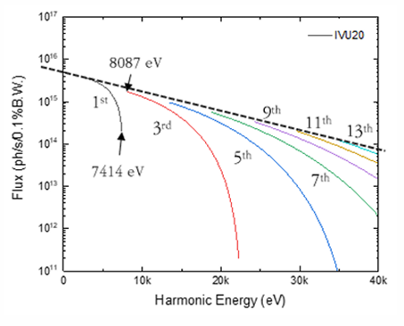
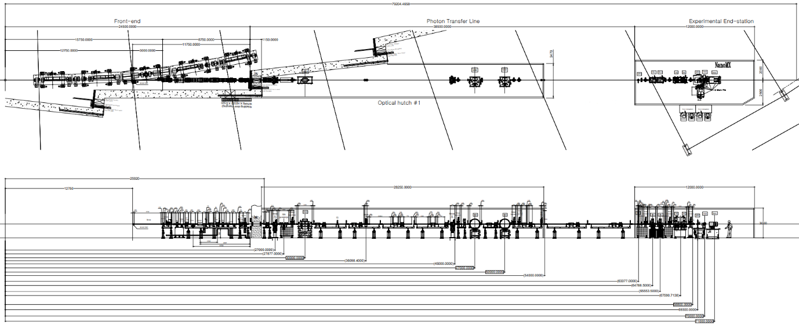

``ID22`` Bio Nano Crystallography (BioNX)
=================================

1. Introduction
---------------

The Bio Nanocrystallography (BioNX) beamline is the first designated MX
beamline for the Korea-4GSR during its initial phase. High coherence and
small beam divergence with high photon flux are advantages of the 4th
generation synchrotron, which enable the design of nanocrystallography
beamline. The in-vacuum undulator20 (IVU20) serves as the light source,
and the beam is tunable within the energy range of 8-25 keV. A
horizontal Double Crystal Monochromator (hDCM) is chosen to achieve the
required beam stabilization. The targeted beam size at the sample
position ranges from 1x1 to 13x13 μm2. Maximum focusing of the beam will
be achieved using a Vertical Focusing Mirror (VFM) and a Horizontal
Focusing Mirror (HFM). Compound refractive lenses (CRLs) will be used to
adjust the beam size as needed to accomplish the fast beam expansion. At
the end station, the MD3 diffractometer and EIGER2 XE 16M detector,
along with a high-capacity sample changer, will be installed. This
beamline is designed to determine the crystal structure of proteins
ranging from nano to micro-sized crystals. The experiments to be
implemented on this beamline include serial synchrotron crystallography,
in-situ crystallography, automated high-throughput screening, and X-ray
fluorescence (XRF). These techniques will enable comprehensive
structural and functional analysis of biological macromolecules,
facilitate efficient drug discovery, and provide detailed elemental
composition data. Additionally, a high-throughput fragment screening
facility will be established for drug discovery experiments.

2. Scientific objective
-----------------------

**2.1 Serial synchrotron crystallography**

The primary technique of the BioNX beamline is serial synchrotron
crystallography (SSX). The demand for analyzing the crystal structures
of challenging proteins has recently increased. Determining crystal
structures using nano to micro-sized protein crystals obtained from
limited protein quantities has become an essential technique in the
field of structural biology. This approach is particularly valuable for
studying proteins that are difficult to crystallize in larger sizes,
thus enabling the structural elucidation of complex and scarce proteins.
To achieve this, serial crystallography techniques have been developed
to reduce radiation damage with high photon flux and small beam size of
the developed synchrotron source. To meet this demand, BioNX beamline
will be designed to utilize a 1-micron beam and a photon flux exceeding
10^14 photons per second. In addition, not only an MD3 diffractometer
with a sphere of confusion value below 200 nm for precise sample
alignment but also an EIGER2 XE 16M detector, capable of capturing
images at up to 560 Hz in full frame mode will be established. This
combination will deliver a high-performance SSX system, enhancing the
efficiency and accuracy of the data collection. The sample delivery
system will primarily provide fixed-target, with plans to implement the
liquid jet method.

**2.2 In-situ crystallography**

In-situ crystallography is a technique used to study the structural
properties of crystals directly in their native environment, without the
need for crystal extraction or transfer. This method minimizes potential
damage and artifacts that can arise during handling and exposure to
non-native conditions. By maintaining the crystals in their natural
state, in-situ crystallography provides more accurate and reliable data
on the molecular structure and dynamics of the sample. This approach is
particularly useful for studying fragile and difficult-to-crystallize
proteins and other macromolecules. The state-of-the-art BioNX beamline,
combined with the small-wedge synchrotron crystallography (SWSX)
technique and advanced computing power, will provide user-friendly
access to in-situ crystallography experiments.

**2.3 Automated high-throughput screening**

Automated high-throughput screening using MX beamlines at synchrotrons
has significantly accelerated the identification of potential drug
candidates by rapidly analyzing numerous protein-ligand complexes. This
is achieved by automating sample handling and data collection, which
facilitates the efficient screening of large compound libraries. The
BioNX beamline will support remote sample delivery and experimentation,
enabling the screening of over 600 samples per day. Additionally, a
dedicated high-throughput fragment screening laboratory will be
established, allowing users to conduct experiments directly at the
accelerator facility. This approach not only enhances the speed and
precision of drug discovery but also provides detailed insights into the
binding interactions and mechanisms of action of potential therapeutic
agents, thereby improving the overall drug development process.

3. Beamline Requirements for the Insertion Device
-------------------------------------------------

The BioNX beamline employs the in-vacuum undulator 20 (IVU20), which
delivers a highly coherent flux and a low heat load of 12 kW (Table 1).
However, it has a feature of a spectral discontinuity between 6.8 keV
and 8.08 keV, thereby limiting the detection of nickel and cobalt during
XRF experiments (Figure 1). The BioNX beamline will cover an energy
range of 8-25 keV with primary operations planned at energy levels of 12
keV and 20 keV.

|image1|

**Figure 1. Predicted photon flux of the IVU 20**

**Table 1. Source Parameter for BioNX beamline**

+---------+-----------+-----------+----------------------+-----------+
| **Undu  | **Period  | **Length  | **Location**         | **Max     |
| lator** | [mm]**    | [m]**     |                      | Power**   |
+---------+-----------+-----------+----------------------+-----------+
| IVU20   | 20        | 3.0       | Center of Straight   | 1.15 kW   |
|         |           |           | section              |           |
+---------+-----------+-----------+----------------------+-----------+

Maximum power refers to the maximum beam power passing through a mask
with an aperture of 2 x 2 mm² @ 23 m using the IVU20.

4. Beamline Requirements for Front End
---------------------------------------

The front end of the BioNX beamline will employ the latest High
Heat-Load Front End, capable of handling up to 12 kW of power designed
to accommodate the in-vacuum undulator 20 (IVU20) beam. This front-end
system will transmit the central cone beam with a divergence of 2.4
sigma (23 μrad). Further details are provided in the ‘Front End’ section
of this report.

5. Beamline Layouts
-------------------

The layout of the BioNX beamline consists of a front-end, an optical
hutch, a long spool, and an experimental hutch (Figure 1). Two separate
enclosed hutches, the optical hutch and the experimental hutch, will be
operated and located at sector ID22. The distance from the undulator to
the sample is 70 meters (Figure 2). Table 1 presents all major beamline
components and their respective locations along the beamline.

|도표, 스케치, 그림, 라인이(가) 표시된 사진 자동 생성된 설명|

**Figure 2. Beamline layout of BioNX**

**5.1 Beamline Component Table**

**Table 2. Component list of BioNX beamline**

+-------------+----------+--------------+---------------+--------------+
| Hutch       | Distance | Component    | Specification | Description  |
| distance    | (m)      |              |               |              |
| (m)         |          |              |               |              |
+=============+==========+==============+===============+==============+
| Optical     | 27       | White beam   | 4-way slit,   | White beam   |
| Hutch       |          | slit         | UHV           | conditioning |
|             |          |              |               |              |
| 26 – 52 m   |          |              |               |              |
+-------------+----------+--------------+---------------+--------------+
|             | 30       | High         | Flat mirror   | Reduce heat  |
|             |          | heat-load    |               | load         |
|             |          | mirror       | 2-stripe      |              |
|             |          |              | coating       |              |
|             |          |              |               |              |
|             |          |              | (Pt, Rh)      |              |
+-------------+----------+--------------+---------------+--------------+
|             | 36       | Attenuator   | CVD Diamond   | Reduce heat  |
|             |          |              |               | load         |
+-------------+----------+--------------+---------------+--------------+
|             | 45       | White beam   | 4-way slit,   | Beam         |
|             |          | slit         | UHV           | conditioning |
+-------------+----------+--------------+---------------+--------------+
|             | 46       | White beam   | Retractable;  | White beam   |
|             |          | screen       | CCTV          | monitor      |
|             |          | monitor      |               |              |
|             |          |              | Diamond BPM   |              |
+-------------+----------+--------------+---------------+--------------+
|             | 47       | horizontal   | Ru/B4C        | M            |
|             |          | DMM          |               | onochromator |
|             |          | \ :sup:`(1)` |               |              |
|             |          |              |               | Pink beam    |
+-------------+----------+--------------+---------------+--------------+
|             | 50       | horizontal   | Si(111)       | M            |
|             |          | DCM          | crystal       | onochromator |
|             |          |              |               |              |
|             |          |              |               | Monobeam     |
+-------------+----------+--------------+---------------+--------------+
|             | 51       | White beam   | Diamond BPM   | White beam   |
|             |          | screen       |               | monitor      |
|             |          | monitor      |               |              |
+-------------+----------+--------------+---------------+--------------+
|             | 52       | Monobeam     | CCTV; cooled  | Monobeam     |
|             |          | screen       |               | profiling    |
|             |          | monitor      |               |              |
+-------------+----------+--------------+---------------+--------------+
| End-station | 65       | QBPM         | Ultra High    | Beam         |
|             |          |              | Vacuum QBPM   | position &   |
| 65-75m      |          |              | (UHV QBPM)    | profile      |
|             |          |              |               | defining     |
|             |          |              | Feedback      |              |
+-------------+----------+--------------+---------------+--------------+
|             | 66       | Monobeam     | 4-way slit,   | Beam         |
|             |          | Slits        | UHV           | conditioning |
+-------------+----------+--------------+---------------+--------------+
|             | 66.2     | Monobeam     | CCTV; cooled  | Monobeam     |
|             |          | screen       |               | profiling    |
|             |          | monitor      |               |              |
+-------------+----------+--------------+---------------+--------------+
|             | 66.5     | CRL-vertical | 1D, Be        | Beam size    |
|             |          |              | coating       | expansion    |
+-------------+----------+--------------+---------------+--------------+
|             | 67       | CR           | 1D, Be        | Beam size    |
|             |          | L-horizontal | coating       | expansion    |
+-------------+----------+--------------+---------------+--------------+
|             | 67.2     | Monobeam     | 4-way slit,   | Beam         |
|             |          | Slits        | UHV           | conditioning |
+-------------+----------+--------------+---------------+--------------+
|             | 67.5     | Monobeam     | CCTV; cooled  | Monobeam     |
|             |          | Sceen        |               | profiling    |
|             |          | monitor      |               |              |
+-------------+----------+--------------+---------------+--------------+
|             | 67.7     | VFM          | Si/ Rh (50)   | Focusing     |
|             |          |              | /Pt (50)      | vertical     |
|             |          |              |               | beam         |
+-------------+----------+--------------+---------------+--------------+
|             | 68.4     | HFM          | Si /Rh (50)   | Focusing     |
|             |          |              | /Pt (50)      | horizontal   |
|             |          |              |               | beam         |
+-------------+----------+--------------+---------------+--------------+
|             | 68.6     | Monobeam     | CCTV; cooled  | Monobeam     |
|             |          | screen       |               | profiling    |
|             |          | monitor      |               |              |
+-------------+----------+--------------+---------------+--------------+
|             | 69.3     | QBPM         | High Vacuum   | Beam         |
|             |          |              | QBPM (HV      | position &   |
|             |          |              | QBPM)         | profile      |
|             |          |              |               | defining     |
+-------------+----------+--------------+---------------+--------------+
|             | 70       | Sample stage | MD3-UP        | Beam         |
|             |          |              |               | di           |
|             |          |              | SOC: <200 nm  | ffractometer |
+-------------+----------+--------------+---------------+--------------+
|             | ~71      | Detector     | EIGER 2 XE    | Detection of |
|             |          |              | 16M           | diffraction  |
|             |          |              |               | pattern      |
+-------------+----------+--------------+---------------+--------------+

(1) Under consideration

