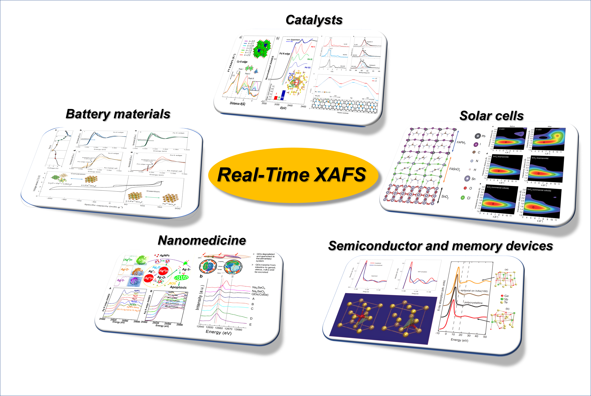
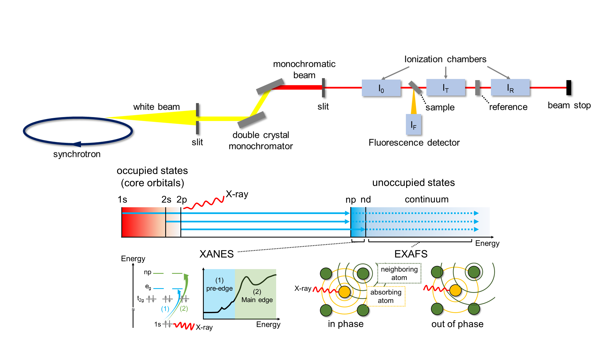
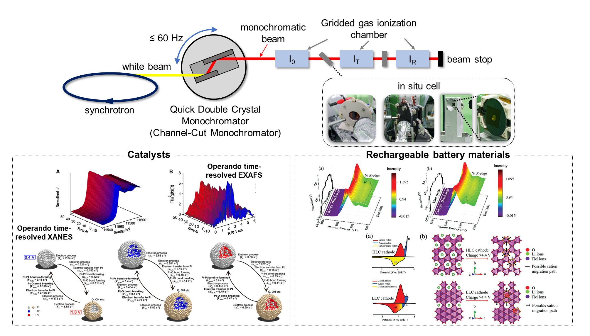
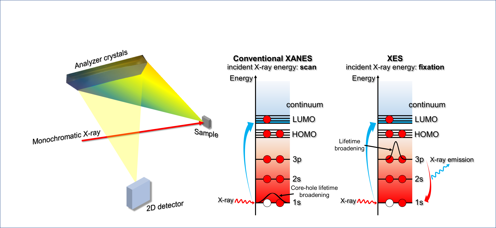
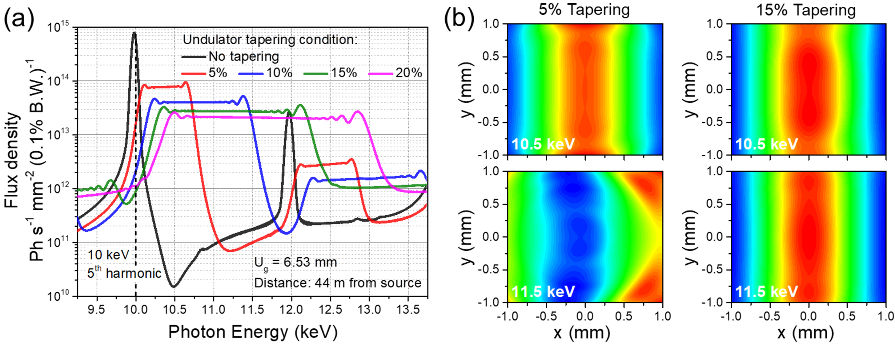

``ID23`` RealTime XAFS (RTXAFS)
===============================

1. Introduction
---------------

The Real-time X-ray Absorption Fine Structure (RXAFS) beamline is a
state-of-the-art tool specifically designed for X-ray absorption and
emission spectroscopy. It will be situated at the ID23 section of the
Korea-4GSR and will utilize an in-vacuum undulator as its light source.
This advanced beamline will produce highly focused and intense X-ray
beams across a wide energy range, derived from electron beams with a low
emittance of about 60 pm·rad. Through offering X-ray Absorption
Spectroscopy (XAS), electronic and local structures can be unveiled by
exciting core electrons to unoccupied orbitals with an external X-ray
that matches the corresponding edges' energy.

The primary experimental technique of the RXAFS beamline is Quick X-ray
Absorption Spectroscopy (QXAS), which enables XAS measurements on a
millisecond time scale. QXAS can be utilized to study various chemical
reaction mechanisms, including the redox processes of battery materials
during charging and discharging, intermediates in catalytic reactions,
and phase transition processes in novel materials. Additionally, the
RXAFS beamline will support X-ray Emission Spectroscopy (XES), providing
in-depth insights into the electronic structure of occupied states in
novel and advanced materials using a variety of analyzer crystals and a
position-sensitive detector.

By delivering both QXAFS and XES, the RXAFS beamline is poised to play a
pivotal role in various advanced material sciences, such as batteries,
catalysts, and biomedicines, and is expected to open up new frontiers in
research.

|image1|
  
**Figure 1**. Expected scientific applications of RXAFS beamline.

2. Scientific objectives
-------------------------

**2.1 X-ray Absorption Spectroscopy (XAS)**

|image2| 
  
**Figure 2.** Schematic illustration of XAS

XAS, an experimental method for gathering data on X-ray intensity before
and after it passes through a material sample, is a versatile tool that
inspires with its potential. This data is then used to apply the
Beer-Lambert law, enabling the determination and analysis of the
sample's X-ray attenuation coefficient. The energy of the absorption
edge, which varies depending on the element type, allows for the
selective analysis of elements using XAS. This versatility means that
even if a sample contains a variety of elements, it is possible to
obtain individual local structure information for a specific element.
Furthermore, XAS is a versatile analysis technique that is not limited
by the presence or absence of crystallinity or the shape of a sample, as
it can observe the local structure around a specific element within a
few angstroms. This versatility is crucial in the development of various
advanced materials, including secondary batteries, catalysts,
semiconductor materials, and solar cells. In the RXAFS beamline, XAS is
a fundamental technique that supports its normal operation with a
user-friendly measurement method.

**2.1 Quick X-ray Absorption Spectroscopy (QXAS)**

|image3|
  
**Figure 3.** Schematic illustration of Quick XAS

XAS, which utilizes hard X-rays and can be measured at room temperature
and normal pressure, is advantageous for in situ/operando analyses. By
employing specific conditions such as temperature, voltage, and
pressure, the in situ XAS technique allows for tracking and observing
changes in the electronic and bonding states of a material under various
reaction conditions. A typical XAS analysis takes several to 10 minutes
per spectrum, capturing the average structural change occurring during
the measurement time. However, the time gap between each XAS spectrum
poses a challenge when studying reaction mechanisms using this
technique. QXAS, on the other hand, is a high-speed measurement
technique that overcomes this challenge. It provides a short measurement
time of several milliseconds to several seconds, enabling real-time XAS
measurements and research into reaction mechanisms without information
gaps.

The focus of QXAS research has primarily been on electrocatalysts. It is
essential to comprehend the reaction mechanisms through QXAS, as the
initial structural changes in the catalyst can significantly impact the
reaction pathway and the resulting products. Recently, QXAS has
demonstrated its capability to unveil the fast-charging process of
cathode materials for lithium-ion batteries by identifying the oxidation
process of each element over time with a sub-second time scale.
Therefore, QXAS is expected to play a vital role in materials
development with improved performance by allowing the observation of
structural changes during various chemical reactions. A key part of this
advancement is the RXAFS beamline, which aims to offer the QXAS method
with a measurement time scale on the order of ten milliseconds by
placing a Quick Double Crystal Monochromator (QDCM) and appropriate
mirror systems in the beamline layout, thereby ensuring the continued
progress and application of QXAS in the field.

**2.3 X-ray Emission Spectroscopy (XES)**

|image4|

**Figure 4**. Schematic illustration of XES

XES with high energy resolution is increasingly pivotal for gaining
insights into electronic and coordination structures by detecting X-ray
fluorescence from core-to-core (CtC) and valence-to-core (VtC)
transitions during the relaxation process. The use of optimal analyzer
crystals, which are crucial for dispersing the X-ray photons into their
respective energies, is imperative to achieve high energy resolution in
XES measurements. CtC XES captures fluorescence signals stemming from
relaxation processes from np orbitals to core 1s orbitals, providing
valuable information about oxidation states. On the other hand, VtC XES
is sensitive to valence band structure, making it possible to discern
ligand coordination and the atoms binding with metal sites.
Additionally, XES can be specialized by integrating time-resolved
techniques to track reaction dynamics and structural phase transitions.

XES, known as a 'photon-in-photon-out' method, requires a high-flux beam
to collect fluorescence signals within a measurement time. The primary
objective of the RXAFS beamline is to support in-situ or real-time
measurements. The powerful beam from the multi-bend achromat-based
storage ring will prove beneficial in reducing measurement time to a few
minutes or even seconds. This exciting development anticipates XES at
the RXAFS beamline to serve as a foundational platform for studying
in-depth electronic and structural changes, especially when combined
with XAS. This combination provides insight into overall electronic
structures, including valence and conduction bands, during in-situ
measurements.

3. Beamline Requirements for the Insertion Device
-------------------------------------------------

The demand for high-quality, high-resolution XAS data is increasing in
the field of advanced and next-generation materials. This XAS data,
obtained from highly intense X-ray beams per unit area, is crucial for
gathering detailed and accurate information about these samples. XAS
beamlines that provide focused and intense X-ray beams generated by an
undulator light source are essential to meet this demand. **Table 1**
provides detailed specifications for the undulator, which has a 24 mm
period and a total length of 3 m.

**Table 1**. Undulator Parameters

+-------+-----+-----+----+-----+-----+----------+---------------------+
| Undu  | Per | Len | U  | K   | Po  | Power    | Max. power after FE |
| lator | iod | gth | \  | \ : | wer | density  |                     |
|       |     |     | :s | sub |     |          | (kW)                |
|       | (   | (m) | ub | :`m | (   | (kW      |                     |
|       | mm) |     | :` | ax` | kW) | mrad\ :s |                     |
|       |     |     | g` |     |     | up:`-2`) |                     |
|       |     |     |    |     |     |          |                     |
|       |     |     | (m |     |     |          |                     |
|       |     |     | m) |     |     |          |                     |
+=======+=====+=====+====+=====+=====+==========+=====================+
| IVU24 | 24  | 3   | 5- | 2.  | 1   | 165      | 0.87                |
|       |     |     | 16 | 747 | 7.9 |          |                     |
|       |     |     |    |     |     |          | Through 2(h)×2(v)   |
|       |     |     |    |     |     |          | mm\ :sup:`2` FE     |
|       |     |     |    |     |     |          | mask                |
+-------+-----+-----+----+-----+-----+----------+---------------------+

The X-ray beam bandwidth produced by the planar undulator is
approximately 1% of the beam energy. XAS consists of two regions: the
X-ray Absorption Near Edge Structure (XANES) near the edge energy and
the Extended X-ray Absorption Fine Structure (EXAFS). To measure XAS up
to the EXAFS region, it is essential to widen the energy bandwidth of
the beam by about 1.5 keV from the planar undulator. The concept of
undulator tapering will be applied at the RXAFS beamline to broaden the
energy bandwidth through positive tapering, where the undulator gap
increases along the undulator length.

|image5|
  
**Figure 5.** The change of photon beam flux and beam shape upon
different tapering conditions. (a) Flux density and bandwidth change
upon tapering condition at an initial gap of 6.53 mm. (b) comparison of
beam shape variation between different tapering conditions.

**Figure 5**\ a shows the flux and bandwidth changes that enter the
white beam slit with a 1 (h) × 1 (v) mm² slit opening under several
undulator tapering conditions. It should be noted that the bandwidth can
be sufficiently broadened by optimizing the tapering conditions. The
undulator tapering conditions, a crucial factor, also significantly
affect the beam shape, as shown in **Figure 5**\ b. In 5% tapering
condition with a 6.53 mm initial gap, the beam shapes at 10.5 keV and
11.5 keV are quite different. However, it can be seen that the unchanged
beam shape at both energies at 15% tapering condition. It can be
concluded that tapering the undulator gap more is necessary to gain the
unchanged beam shape along the beam energy change to measure the XAS,
including the EXAFS region.

4. Beamline Requirements for the Front End
------------------------------------------

The RXAFS beamline will employ the latest High Heat-Load Front End,
capable of handling up to 18 kW of power. It will feature a windowless
exit design with a 2 (h) × 2 (v) mm\ :sup:`2` exit mask aperture, which
is essential for maintaining optimal performance. Further details are
provided in the ‘Front End’ section of this report.

