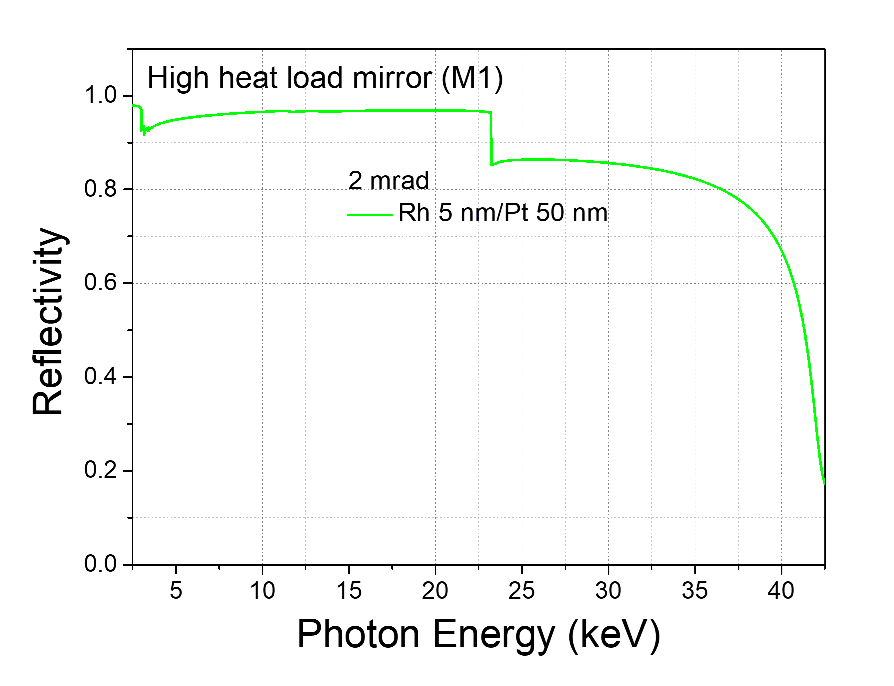
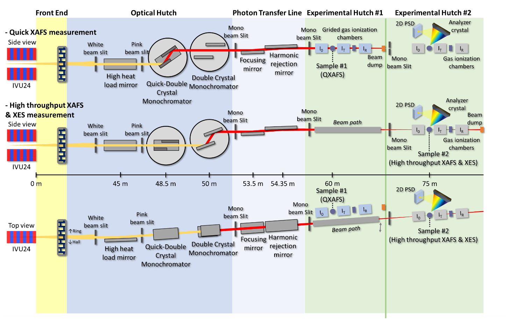
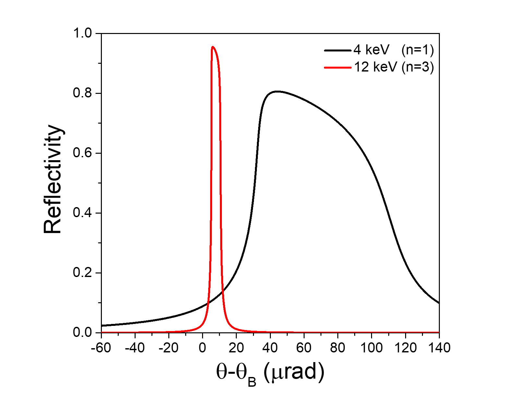
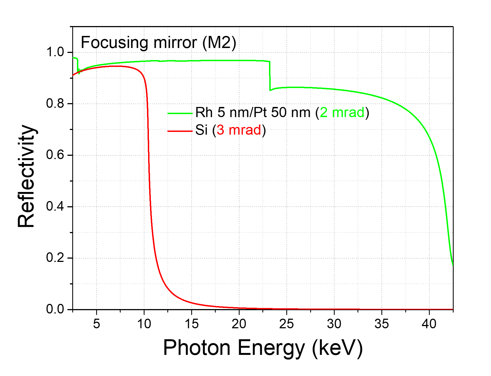

``ID23`` RealTime XAFS (RTXAFS)
===============================

1. Introduction
----------------

The Real-time X-ray Absorption Fine Structure (RXAFS) beamline is a
state-of-the-art tool specifically designed for X-ray absorption and
emission spectroscopy. It will be situated at the ID23 section of the
Korea-4GSR and will utilize an in-vacuum undulator as its light source.
This advanced beamline will produce highly focused and intense X-ray
beams across a wide energy range, derived from electron beams with a low
emittance of about 60 pm·rad. Through offering X-ray Absorption
Spectroscopy (XAS), electronic and local structures can be unveiled by
exciting core electrons to unoccupied orbitals with an external X-ray
that matches the corresponding edges' energy.

The primary experimental technique of the RXAFS beamline is Quick X-ray
Absorption Spectroscopy (QXAS), which enables XAS measurements on a
millisecond time scale. QXAS can be utilized to study various chemical
reaction mechanisms, including the redox processes of battery materials
during charging and discharging, intermediates in catalytic reactions,
and phase transition processes in novel materials. Additionally, the
RXAFS beamline will support X-ray Emission Spectroscopy (XES), providing
in-depth insights into the electronic structure of occupied states in
novel and advanced materials using a variety of analyzer crystals and a
position-sensitive detector.

By delivering both QXAFS and XES, the RXAFS beamline is poised to play a
pivotal role in various advanced material sciences, such as batteries,
catalysts, and biomedicines, and is expected to open up new frontiers in
research.

|image1|

**Figure 1**. Expected scientific applications of RXAFS beamline.

2. Scientific objectives
------------------------

**2.1 X-ray Absorption Spectroscopy (XAS)**

|image2|

**Figure 2.** Schematic illustration of XAS

XAS, an experimental method for gathering data on X-ray intensity before
and after it passes through a material sample, is a versatile tool that
inspires with its potential. This data is then used to apply the
Beer-Lambert law, enabling the determination and analysis of the
sample's X-ray attenuation coefficient. The energy of the absorption
edge, which varies depending on the element type, allows for the
selective analysis of elements using XAS. This versatility means that
even if a sample contains a variety of elements, it is possible to
obtain individual local structure information for a specific element.
Furthermore, XAS is a versatile analysis technique that is not limited
by the presence or absence of crystallinity or the shape of a sample, as
it can observe the local structure around a specific element within a
few angstroms. This versatility is crucial in the development of various
advanced materials, including secondary batteries, catalysts,
semiconductor materials, and solar cells. In the RXAFS beamline, XAS is
a fundamental technique that supports its normal operation with a
user-friendly measurement method.

**2.1 Quick X-ray Absorption Spectroscopy (QXAS)**

|image3|

**Figure 3.** Schematic illustration of Quick XAS

XAS, which utilizes hard X-rays and can be measured at room temperature
and normal pressure, is advantageous for in situ/operando analyses. By
employing specific conditions such as temperature, voltage, and
pressure, the in situ XAS technique allows for tracking and observing
changes in the electronic and bonding states of a material under various
reaction conditions. A typical XAS analysis takes several to 10 minutes
per spectrum, capturing the average structural change occurring during
the measurement time. However, the time gap between each XAS spectrum
poses a challenge when studying reaction mechanisms using this
technique. QXAS, on the other hand, is a high-speed measurement
technique that overcomes this challenge. It provides a short measurement
time of several milliseconds to several seconds, enabling real-time XAS
measurements and research into reaction mechanisms without information
gaps.

The focus of QXAS research has primarily been on electrocatalysts. It is
essential to comprehend the reaction mechanisms through QXAS, as the
initial structural changes in the catalyst can significantly impact the
reaction pathway and the resulting products. Recently, QXAS has
demonstrated its capability to unveil the fast-charging process of
cathode materials for lithium-ion batteries by identifying the oxidation
process of each element over time with a sub-second time scale.
Therefore, QXAS is expected to play a vital role in materials
development with improved performance by allowing the observation of
structural changes during various chemical reactions. A key part of this
advancement is the RXAFS beamline, which aims to offer the QXAS method
with a measurement time scale on the order of ten milliseconds by
placing a Quick Double Crystal Monochromator (QDCM) and appropriate
mirror systems in the beamline layout, thereby ensuring the continued
progress and application of QXAS in the field.

**2.3 X-ray Emission Spectroscopy (XES)**

|image4|

**Figure 4.** Schematic illustration of XES

XES with high energy resolution is increasingly pivotal for gaining
insights into electronic and coordination structures by detecting X-ray
fluorescence from core-to-core (CtC) and valence-to-core (VtC)
transitions during the relaxation process. The use of optimal analyzer
crystals, which are crucial for dispersing the X-ray photons into their
respective energies, is imperative to achieve high energy resolution in
XES measurements. CtC XES captures fluorescence signals stemming from
relaxation processes from np orbitals to core 1s orbitals, providing
valuable information about oxidation states. On the other hand, VtC XES
is sensitive to valence band structure, making it possible to discern
ligand coordination and the atoms binding with metal sites.
Additionally, XES can be specialized by integrating time-resolved
techniques to track reaction dynamics and structural phase transitions.

XES, known as a 'photon-in-photon-out' method, requires a high-flux beam
to collect fluorescence signals within a measurement time. The primary
objective of the RXAFS beamline is to support in-situ or real-time
measurements. The powerful beam from the multi-bend achromat-based
storage ring will prove beneficial in reducing measurement time to a few
minutes or even seconds. This exciting development anticipates XES at
the RXAFS beamline to serve as a foundational platform for studying
in-depth electronic and structural changes, especially when combined
with XAS. This combination provides insight into overall electronic
structures, including valence and conduction bands, during in-situ
measurements.

3. Beamline Requirements for the Insertion Device
-------------------------------------------------

The demand for high-quality, high-resolution XAS data is increasing in
the field of advanced and next-generation materials. This XAS data,
obtained from highly intense X-ray beams per unit area, is crucial for
gathering detailed and accurate information about these samples. XAS
beamlines that provide focused and intense X-ray beams generated by an
undulator light source are essential to meet this demand. **Table 1**
provides detailed specifications for the undulator, which has a 24 mm
period and a total length of 3 m.

**Table 1**. Undulator Parameters

+-------+-----+-----+----+-----+-----+----------+---------------------+
| Undu  | Per | Len | U  | K   | Po  | Power    | Max. power after FE |
| lator | iod | gth | \  | \ : | wer | density  |                     |
|       |     |     | :s | sub |     |          | (kW)                |
|       | (   | (m) | ub | :`m | (   | (kW      |                     |
|       | mm) |     | :` | ax` | kW) | mrad\ :s |                     |
|       |     |     | g` |     |     | up:`-2`) |                     |
|       |     |     |    |     |     |          |                     |
|       |     |     | (m |     |     |          |                     |
|       |     |     | m) |     |     |          |                     |
+=======+=====+=====+====+=====+=====+==========+=====================+
| IVU24 | 24  | 3   | 5- | 2.  | 1   | 165      | 0.87                |
|       |     |     | 16 | 747 | 7.9 |          |                     |
|       |     |     |    |     |     |          | Through 2(h)×2(v)   |
|       |     |     |    |     |     |          | mm\ :sup:`2` FE     |
|       |     |     |    |     |     |          | mask                |
+-------+-----+-----+----+-----+-----+----------+---------------------+

The X-ray beam bandwidth produced by the planar undulator is
approximately 1% of the beam energy. XAS consists of two regions: the
X-ray Absorption Near Edge Structure (XANES) near the edge energy and
the Extended X-ray Absorption Fine Structure (EXAFS). To measure XAS up
to the EXAFS region, it is essential to widen the energy bandwidth of
the beam by about 1.5 keV from the planar undulator. The concept of
undulator tapering will be applied at the RXAFS beamline to broaden the
energy bandwidth through positive tapering, where the undulator gap
increases along the undulator length.

|image5|

**Figure 5.** The change of photon beam flux and beam shape upon
different tapering conditions. (a) Flux density and bandwidth change
upon tapering condition at an initial gap of 6.53 mm. (b) comparison of
beam shape variation between different tapering conditions.

**Figure 5**\ a shows the flux and bandwidth changes that enter the
white beam slit with a 1 (h) × 1 (v) mm² slit opening under several
undulator tapering conditions. It should be noted that the bandwidth can
be sufficiently broadened by optimizing the tapering conditions. The
undulator tapering conditions, a crucial factor, also significantly
affect the beam shape, as shown in **Figure 5**\ b. In 5% tapering
condition with a 6.53 mm initial gap, the beam shapes at 10.5 keV and
11.5 keV are quite different. However, it can be seen that the unchanged
beam shape at both energies at 15% tapering condition. It can be
concluded that tapering the undulator gap more is necessary to gain the
unchanged beam shape along the beam energy change to measure the XAS,
including the EXAFS region.

4. Beamline Requirements for the Front End
------------------------------------------

The RXAFS beamline will employ the latest High Heat-Load Front End,
capable of handling up to 18 kW of power. It will feature a windowless
exit design with a 2 (h) × 2 (v) mm\ :sup:`2` exit mask aperture, which
is essential for maintaining optimal performance. Further details are
provided in the ‘Front End’ section of this report.

5. Beamline Layout
-----------------

**Table 2** includes the design goals of the beamline. The beamline
layout is designed to meet these goals and satisfy users’ demands
regarding QXAS and XES.

**Table 2**. Beamline design goals

+-----------------+---------------+-----------------------------------+
| **Light         | In-vacuum     |                                   |
| Source**        | Undulator     |                                   |
|                 | (IVU24, 3m)   |                                   |
+=================+===============+===================================+
| **Energy        | 4 - 40 keV    |                                   |
| Range**         |               |                                   |
+-----------------+---------------+-----------------------------------+
| **Measurement   | Quick XAFS    | ~ 50 ms                           |
| time for one    |               |                                   |
| EXAFS data**    |               |                                   |
+-----------------+---------------+-----------------------------------+
|                 | Normal XAFS   | ~ 3 min (on-the-fly scan)         |
|                 |               |                                   |
|                 |               | ~ 20 min (step scan)              |
+-----------------+---------------+-----------------------------------+
| **Energy        | ~ 1.4 ×       |                                   |
| resolution      | 10\ :sup:`-4` |                                   |
| (ΔE/E)**        | Si (111) / ~  |                                   |
|                 | 3 ×           |                                   |
|                 | 10\ :sup:`-5` |                                   |
|                 | Si (311)      |                                   |
+-----------------+---------------+-----------------------------------+
| **Beam size at  | 18 (H) × 8    |                                   |
| sample position | (V)           |                                   |
| (@ 10 keV)**    | μm\ :sup:`2`  |                                   |
|                 | (focused      |                                   |
|                 | beam, @ 75 m) |                                   |
|                 |               |                                   |
|                 | 1020 (H) ×    |                                   |
|                 | 810 (V)       |                                   |
|                 | μm\ :sup:`2`  |                                   |
|                 | (unfocused    |                                   |
|                 | beam, @ 60 m) |                                   |
+-----------------+---------------+-----------------------------------+
| **Beam flux at  | Tuned         | ~ 9 × 10\ :sup:`13` (@ 5 keV)     |
| sample position | Undulator     |                                   |
| (ph/s)**        |               | ~ 4 × 10\ :sup:`12` (@ 40 keV)    |
+-----------------+---------------+-----------------------------------+
|                 | Tapered       | ~ 2 × 10\ :sup:`12` (@ 7 keV)     |
|                 | Undulator     |                                   |
|                 |               | ~ 3 × 10\ :sup:`11` (@ 25 keV)    |
+-----------------+---------------+-----------------------------------+
| **Main          | - High Heat   |                                   |
| equipment**     | Load Mirror   |                                   |
|                 | (HHLM)        |                                   |
|                 |               |                                   |
|                 | -             |                                   |
|                 | Co            |                                   |
|                 | ntinuous-scan |                                   |
|                 | Double        |                                   |
|                 | Crystal       |                                   |
|                 | Monochromator |                                   |
|                 | (C-DCM)       |                                   |
|                 |               |                                   |
|                 | - 60 Hz Quick |                                   |
|                 | Double        |                                   |
|                 | Crystal       |                                   |
|                 | Monochromator |                                   |
|                 | (Quick DCM)   |                                   |
|                 |               |                                   |
|                 | - Energy      |                                   |
|                 | Dispersive    |                                   |
|                 | Fluorescence  |                                   |
|                 | Detector      |                                   |
|                 |               |                                   |
|                 | -             |                                   |
|                 | Fast-response |                                   |
|                 | Gas           |                                   |
|                 | Ionization    |                                   |
|                 | Chambers      |                                   |
|                 |               |                                   |
|                 | - 2D Position |                                   |
|                 | Sensitive     |                                   |
|                 | Detector (2D  |                                   |
|                 | PSD)          |                                   |
+-----------------+---------------+-----------------------------------+
| **Experimental  | -             |                                   |
| equipment**     | Hi            |                                   |
|                 | gh-throughput |                                   |
|                 | sample holder |                                   |
|                 | & Sample      |                                   |
|                 | auto-changing |                                   |
|                 | system        |                                   |
|                 |               |                                   |
|                 | - von Hamos   |                                   |
|                 | spectrometer  |                                   |
+-----------------+---------------+-----------------------------------+
|                 | In situ       | - Electrochemistry & Battery cell |
|                 | experiments   |                                   |
|                 |               | - Cryogenic cooling cell (> -196  |
|                 |               | ℃)                                |
|                 |               |                                   |
|                 |               | - Heating cell (< 1200 ℃)         |
|                 |               |                                   |
|                 |               | - High-temperature cell for       |
|                 |               | thermocatalysis (heating & gas    |
|                 |               | environment)                      |
|                 |               |                                   |
|                 |               | - Mass analyzer                   |
+-----------------+---------------+-----------------------------------+

The beamline layout of RXAFS is illustrated in **Figure 6**. The first
optics after the Front-End is the High Heat Load Mirror (HHLM),
reflecting the beam from the Front-End in the horizontal direction and
serving two crucial functions. Firstly, the HHLM reduces the thermal
load impacting DCM’s 1st crystal by absorbing the high-energy X-ray
beams. Secondly, it collimates the X-ray beam by the sagittal radius of
the mirror surface. This collimation improves the energy resolution of
the monochromatic beam after passing the Double Crystal Monochromator
(DCM). Furthermore, it minimizes the beam flux loss due to the
limitation of Darwin’s width of the Si crystal of DCM.

|image6|

**Figure 6**. Schematic illustration for beamline layout.

The QDCM, located 48.5 m from the source and 3.5 m after HHLM, plays a
key role in the beamline. It enables rapid changes in beam energy with a
10-50 Hz speed, facilitating using the QXAS method. Positioned 50 m from
the source after the QDCM, the standard DCM provides a more stable
monochromatic beam than the QDCM. This stability is essential for
standard XAS and XES measurements, where maintaining a constant beam
position during the measurement is critical for obtaining high-quality
data. By having both DCMs available in the beamline layout, users have
the flexibility to choose the appropriate monochromator based on the
experimental method.

The horizontal focusing mirror (HFM) system will be positioned 53.5 m
from the source. It will consist of two sagittal cylinder mirrors with
different radius of curvature and reflect the beam in a vertical
direction (upside). The two mirrors have different mirror surface
materials: one has a bare Si mirror surface without any coating, while
the other has a 5 nm Rh / 50 nm Pt bilayer as coating material. The
selection of a mirror depends on the energy range being used. Mirrors
can be swapped with each other to deliver high-energy X-ray beams or to
efficiently suppress the higher-harmonic beam, which cannot be removed
by DCMs.

The harmonic rejection mirror (HRM) system will be positioned 54.35 m
from the source, directly behind the horizontal focusing mirror system.
It will reflect the beam downward in the vertical direction at the same
reflection angle as the focusing mirror to maintain the vertical beam
position. The HRM has a flat mirror surface that a bender in the system
can bend to focus the beam vertically. It consists of three stripes: Si,
Rh 5nm/Pt 50 nm, and Pt 50 nm layers. Similar to the HFM, these layers
can be interchanged based on the X-ray energy to be used. The HRM is
important for parallelizing the beam reflected from the HFM to minimize
the change in vertical beam position caused by varying HFM incidence
angles.

There will be two designated sample positions labeled #1 and #2, located
60 m and 75 m from the source, respectively. A beam path should be
installed at sample position #1 to deliver the beam for experiments
conducted at sample position #2. Sample position #1 will be specifically
assigned for conducting QXAS experiments, so equipped with three
fast-responsive ionization chambers and a PIPS fluorescence detector.
Sample position #2, on the other hand, will be used for conducting
standard XAS (or High-Throughput XAS) and XES experiments.

**5.1 Beamline Component Table**

**Table 3** includes the main components of the RXAFS beamline and their
location from the source.

**Table 3**. Main components

+----------+-----------+----------------+----------------------------+
| **Com    | *         | **S            | **Usage**                  |
| ponent** | *Distance | pecification** |                            |
|          | from      |                |                            |
|          | source**  |                |                            |
+==========+===========+================+============================+
| PBPM-3   | 41 m      | Pick-up type   | Diagnosing white beam      |
|          |           |                | position                   |
+----------+-----------+----------------+----------------------------+
| Movable  | 42 m      | Water Cooled   | Aligning the white beam    |
| Mask     |           |                |                            |
+----------+-----------+----------------+----------------------------+
| At       | 43.7 m    | Water Cooled,  | Removing low-energy X-ray  |
| tenuator |           |                | beam                       |
|          |           | CVD Diamond,   |                            |
|          |           | B              |                            |
|          |           | \ :sub:`4`\ C, |                            |
|          |           | Si             |                            |
+----------+-----------+----------------+----------------------------+
| White    | 44 m      | Water Cooled,  | 1) Eliminating the heat    |
| Beam     |           |                | load by the white beam     |
| Slit     |           | Max. opening   |                            |
|          |           | size:          | 2) Preventing the          |
|          |           |                | accidents due to           |
|          |           | 1.2(h)×1.2(v)  | malfunction of the movable |
|          |           | mm\ :sup:`2`   | mask                       |
|          |           |                |                            |
|          |           |                | 3) Diagnosing beam         |
|          |           |                | position through electron  |
|          |           |                | current readout function   |
+----------+-----------+----------------+----------------------------+
| HHLM     | 45 m      | In-Ga eutectic | 1) Eliminating of heat     |
| (High    |           | cooled         | load by high-energy X-ray  |
| Heat     |           |                | beams                      |
| Load     |           | 1× sagittal    |                            |
| Mirror)  |           | cylinder       | 2) Collimating the X-ray   |
|          |           | mirror         | beams                      |
|          |           |                |                            |
|          |           | (Rh 5 nm/Pt 50 |                            |
|          |           | nm)            |                            |
+----------+-----------+----------------+----------------------------+
| Pink     | 47 m      | Water Cooled   | 1) Aligning the pink beam  |
| Beam     |           |                |                            |
| Slit     |           |                | 2) Removing the scattered  |
|          |           |                | beams                      |
|          |           |                |                            |
|          |           |                | 3) Diagnosing beam         |
|          |           |                | position through electron  |
|          |           |                | current readout function   |
+----------+-----------+----------------+----------------------------+
| Pink     | 47.4 m    | Water Cooled,  | 1) Aligning the HHLM       |
| Beam     |           | YAG+CCD        |                            |
| Screen   |           |                | 2) Diagnosing pink beam    |
|          |           |                | shape                      |
+----------+-----------+----------------+----------------------------+
| QDCM     | 48.5 m    | Si(111)&(311)  | 1) Monochromatization of   |
|          |           |                | the X-ray beam             |
|          |           | LN2 Cooled     |                            |
|          |           |                | 2) Fast energy scanning    |
|          |           |                | speed of 10 ~ 50 Hz        |
+----------+-----------+----------------+----------------------------+
| DCM      | 50 m      | Si(111)&(311)  | Monochromatization of the  |
|          |           |                | X-ray beam                 |
|          |           | LN2 Cooled     |                            |
+----------+-----------+----------------+----------------------------+
| Pink     | 50.8 m    | Water Cooled,  | 1) Blocking the pink beam  |
| Beam     |           |                |                            |
| Stop     |           | YAG+CCD        | 2) Aligning the DCM        |
+----------+-----------+----------------+----------------------------+
| Mono     | 52.4 m    | 4 way-slit     | 1) Aligning the mono beam  |
| Beam     |           |                |                            |
| Slit     |           |                | 2) Removing the scattered  |
|          |           |                | beams                      |
+----------+-----------+----------------+----------------------------+
| Diamond  | 52.6 m    | CVD diamond.   | 1) Aligning the mono beam  |
| screen   |           |                |                            |
| monitor  |           | Thickness: 50  | 2) DCM 2\ :sup:`nd`        |
|          |           | μm             | crystal feedback           |
+----------+-----------+----------------+----------------------------+
| HFM      | 53.5 m    | 2×sagittal     | 1) Focusing the beam in    |
| (Ho      |           | cylinder       | the horizontal direction   |
| rizontal |           | mirror         |                            |
| Focusing |           |                | 2) Removing high-harmonic  |
| mirror)  |           | (Si, Rh 5      | X-ray beams                |
|          |           | nm/Pt 50 nm)   |                            |
+----------+-----------+----------------+----------------------------+
| HRM      | 54.35 m   | Flat mirror    | 1) Focusing the beam in    |
| (        |           |                | the vertical direction     |
| Harmonic |           | 3×Strip (Si,   |                            |
| R        |           | Rh 5 nm/Pt 50  | 2) Removing high-harmonic  |
| ejection |           | nm, Pt 50 nm)  | X-ray beams                |
| Mirror)  |           |                |                            |
|          |           |                | 3) Parallelizing the beam  |
|          |           |                | path                       |
+----------+-----------+----------------+----------------------------+
| Mono     | 55.5 m    | 4 way-slit     | 1) Aligning the mono beam  |
| Beam     |           |                |                            |
| Slit     |           |                | 2) Removing the scattered  |
|          |           |                | beams                      |
+----------+-----------+----------------+----------------------------+
| Mono     | 55.8 m    | YAG+CCD        | 1) Blocking the mono beam  |
| Beam     |           |                |                            |
| Screen   |           |                | 2) Diagnosing mono beam    |
|          |           |                | shape                      |
|          |           |                |                            |
|          |           |                | 3) Aligning the DCM        |
+----------+-----------+----------------+----------------------------+
| Diamond  | 58 m      | CVD diamond    | 1) Diagnosing mono beam    |
| screen   |           |                | position                   |
| monitor  |           | Thickness: 50  |                            |
|          |           | μm             | 2) HRM feedback            |
|          |           |                | (long-term)                |
+----------+-----------+----------------+----------------------------+
| Hutch    | 58.6 m    |                | Blocking the mono beam     |
| Shutter  |           |                |                            |
+----------+-----------+----------------+----------------------------+
| Hutch    | 59.2 m    | 4 way-slit     | Defining the mono beam     |
| Slit     |           |                |                            |
+----------+-----------+----------------+----------------------------+
| Sample   | 60 m      | Grided Gas     | QXAS experiment stage      |
| Position |           | Ionization     |                            |
| #1       |           | Chamber,       |                            |
| (QXAS)   |           |                |                            |
|          |           | PIPS,          |                            |
|          |           |                |                            |
|          |           | In Situ Cell   |                            |
+----------+-----------+----------------+----------------------------+
| Mono     | 66 m      | YAG+CCD        | 1) Blocking the mono beam  |
| Beam     |           |                |                            |
| Screen   |           |                | 2) Diagnosing mono beam    |
|          |           |                | shape                      |
+----------+-----------+----------------+----------------------------+
| Hutch    | 72 m      | 4 way-slit     | Defining the mono beam     |
| Slit     |           |                |                            |
+----------+-----------+----------------+----------------------------+
| Nanobeam | 74.5 m    | Kapton,        | Diagnosing mono beam shape |
| position |           | Thickness:     | and position               |
| monitor  |           |                |                            |
|          |           | 75 μm          |                            |
|          |           |                |                            |
|          |           | Positional     |                            |
|          |           | resolution: <  |                            |
|          |           | 100 nm         |                            |
+----------+-----------+----------------+----------------------------+
| Sample   | 75 m      | Gas Ionization | XES & High-throughput XAS  |
| Position |           | Chamber        | experiment stage           |
| #2       |           |                |                            |
| (        |           | Analyzer       |                            |
| XAS+XES) |           | Crystals       |                            |
|          |           |                |                            |
|          |           | (JJ-X ray),    |                            |
|          |           |                |                            |
|          |           | Energy         |                            |
|          |           | Dispersive     |                            |
|          |           | Fluorescence   |                            |
|          |           | Detector,      |                            |
|          |           |                |                            |
|          |           | 2D PSD         |                            |
+----------+-----------+----------------+----------------------------+

6. Optics Overview
------------------

**6.1 Optics Specifications**

The detailed specifications for the optics are listed in **Table 4**.

**Table 4**. Optics specifications

+-------------+-----------+---------+---------+------------+--------+
|             | **HHLM**  | *       | **DCM** | **HFM**    | *      |
|             |           | *QDCM** |         |            | *HRM** |
+=============+===========+=========+=========+============+========+
| **Distance  | 45        | 48.5    | 50      | 53.5       | 54.35  |
| from source |           |         |         |            |        |
| (m)**       |           |         |         |            |        |
+-------------+-----------+---------+---------+------------+--------+
| **Incident  | 2 mrad    | 4.      | 4.      | 2-3 mrad   | 2-3    |
| Angle**     |           | 5–30\ : | 5–30\ : |            | mrad   |
|             |           | sup:`o` | sup:`o` |            |        |
|             |           |         |         |            |        |
|             |           | (Si     | (Si     |            |        |
|             |           | 111)    | 111)    |            |        |
|             |           |         |         |            |        |
|             |           | 5.      | 5.      |            |        |
|             |           | 0–15\ : | 0–15\ : |            |        |
|             |           | sup:`o` | sup:`o` |            |        |
|             |           |         |         |            |        |
|             |           | (Si     | (Si     |            |        |
|             |           | 311)    | 311)    |            |        |
+-------------+-----------+---------+---------+------------+--------+
| **Shape**   | Sagittal  | Flat    | Flat    | C          | Flat   |
|             | cylinder  |         |         | ylindrical |        |
+-------------+-----------+---------+---------+------------+--------+
| *           | 7 – 40 km | -       | -       | ∞          | 12 –   |
| *Tangential |           |         |         |            | 25 km  |
| Radius      | (bender)  |         |         |            |        |
| (km)**      |           |         |         |            | (b     |
|             |           |         |         |            | ender) |
+-------------+-----------+---------+---------+------------+--------+
| **Sagittal  | 180       | -       | -       | 61.4 (2    | ∞      |
| Radius      |           |         |         | mrad):     |        |
| (mm)**      |           |         |         |            |        |
|             |           |         |         | [Rh 5      |        |
|             |           |         |         | nm/Pt 50   |        |
|             |           |         |         | nm]        |        |
|             |           |         |         |            |        |
|             |           |         |         | 92.0 (3    |        |
|             |           |         |         | mrad):     |        |
|             |           |         |         | [Si]       |        |
+-------------+-----------+---------+---------+------------+--------+
| **Surface   | H         | V       |         |            |        |
| Normal      | orizontal | ertical |         |            |        |
| direction** |           |         |         |            |        |
+-------------+-----------+---------+---------+------------+--------+
| **          | Si        | Si(111) | Si(111) | Si         | Si     |
| Substrate** |           | /       | /       |            |        |
|             |           | Si(311) | Si(311) |            |        |
+-------------+-----------+---------+---------+------------+--------+
| **Coating   | [Rh 5     | -       | -       | [Si]       | [Si]   |
| Materials** | nm/Pt 50  |         |         |            |        |
|             | nm]       |         |         | [Rh 5      | [Rh 5  |
| **          |           |         |         | nm/Pt 50   | nm/Pt  |
| (Thickness, |           |         |         | nm]        | 50     |
| nm)**       |           |         |         |            | nm],   |
|             |           |         |         |            |        |
|             |           |         |         |            | [Pt 50 |
|             |           |         |         |            | nm]    |
+-------------+-----------+---------+---------+------------+--------+
| **Beam size | 1200×1160 | 12      | 13      | 1410×1170  | 136    |
| (H×V)**     |           | 90×1190 | 30×1190 |            | 0×1120 |
|             |           |         |         |            |        |
| **@ 10      |           |         |         |            |        |
| keV**       |           |         |         |            |        |
|             |           |         |         |            |        |
| **(μm×μm)** |           |         |         |            |        |
+-------------+-----------+---------+---------+------------+--------+
| **Footprint | 600×1.2   | 18×1.2  | 18×1.2  | 600×1.2    | 6      |
| (L × H)**   |           |         |         |            | 00×1.2 |
|             |           |         |         |            |        |
| **(mm×mm)** |           |         |         |            |        |
+-------------+-----------+---------+---------+------------+--------+
| **Substrate | 800×50×55 | 5       | 6       | 600×60×50  | 800    |
| size**      |           | 5×40×50 | 0×25×50 |            | ×50×50 |
|             |           |         |         |            |        |
| **(L×W×H)** |           | (1\ :s  | (1\ :s  |            |        |
|             |           | up:`st` | up:`st` |            |        |
| **(         |           | c       | c       |            |        |
| mm×mm×mm)** |           | rystal) | rystal) |            |        |
+-------------+-----------+---------+---------+------------+--------+
| **Focus     | ∞         | -       | -       | 21.5 m     | ∞      |
| distance**  |           |         |         |            |        |
|             |           |         |         |            |        |
| **(m)**     |           |         |         |            |        |
+-------------+-----------+---------+---------+------------+--------+
| *           | < 0.3 nm  | < 1 μm  | < 1 μm  | < 0.3 nm   | < 0.3  |
| *Roughness, |           |         |         |            | nm     |
| σ**         |           |         |         |            |        |
|             |           |         |         |            |        |
| *           |           |         |         |            |        |
| *(r.m.s.)** |           |         |         |            |        |
+-------------+-----------+---------+---------+------------+--------+
| **Slope     | <1.5/<5.0 | <1      | <1      | <1.5/<5.0  | <0.2   |
| error**     |           |         |         |            | 5/<1.0 |
|             |           |         |         |            |        |
| **          |           |         |         |            |        |
| (Tangential |           |         |         |            |        |
| /           |           |         |         |            |        |
| sagittal)** |           |         |         |            |        |
|             |           |         |         |            |        |
| **(μrad,    |           |         |         |            |        |
| r.m.s.)**   |           |         |         |            |        |
+-------------+-----------+---------+---------+------------+--------+
| **Max total | 16.3      | 56.1    | 52.8    | -          | -      |
| heat load** |           |         |         |            |        |
|             |           |         |         |            |        |
| **(W)**     |           |         |         |            |        |
+-------------+-----------+---------+---------+------------+--------+
| **Max       | 0.0326    | 28.1    | 26.4    | -          | -      |
| surface     |           |         |         |            |        |
| heat load** | (@4 keV)  | (@4     | (@4     |            |        |
|             |           | keV)    | keV)    |            |        |
| **(W        |           |         |         |            |        |
| mm\ -2)**   |           |         |         |            |        |
+-------------+-----------+---------+---------+------------+--------+

**6.2 High Heat Load Mirror (HHLM)**

The HHLM, located at 45 m from the source, will serve the following
purposes:

-  Beam collimation

-  High heat load management

   Figure 7. Reflectivity curve of the HHLM

HHLM will be the first optical component of the RXAFS beamline. To
deliver photon beams with an energy range of 4-40 keV, Rh 5 nm/Pt 50 nm
bilayer will be used as a coating material for the mirror surface. The
incident angle of the beam will be set at 2 mrad and will be fixed
during operation to satisfy the ease of the beam alignment process.
**Figure 7** shows the reflectivity curve of the HHLM corresponding to
photon energy, with no noticeable reflectivity decrease across the
entire energy range of 4-40 keV. The HHLM reflects the beam horizontally
and is cylindrical in the sagittal direction of the mirror crystal.
Accordingly, it can collimate a beam vertically, thereby enhancing the
energy resolution of a monochromatic beam and reducing flux loss due to
the limited Darwin width of the Si crystal in the monochromator.

**6.3 Quick Double Crystal Monochromator (QDCM)**

The QDCM, located at 48.5 m from the source, will serve the following
purposes:

-  Quick-monochromatization

The crystal stage of QDCM will consist of two liquid nitrogen-cooled
channel-cut crystals (Si (111) and Si (311)) placed next to each other,
and the crystals can be switched depending on the photon energy to be
used. The QDCM will have a maximum scanning speed of 60 Hz, enabling XAS
measurements every ten milliseconds when XAS data are obtained in both
forward and reverse scanning directions. The typical measurement time
for XAS using standard DCM is a few seconds to a few minutes. It is
important to note that QDCM is crucial for the RXAFS beamline because
the main goal of the beamline is to provide real-time measurement
methods during various in situ/operando experiments.

**Table 5**. Motor specifications

+-----------------+--------------------------+------+------------------+
| **Scan mode**   | **Movement**             | *    | **Motor Speed**  |
|                 |                          | *Ran |                  |
|                 |                          | ge** | **(frequency**)  |
+=================+==========================+======+==================+
| Bragg angle     | Goniometer step motor    | 4° ~ | 1° s\ :sup:`-1`  |
|                 |                          | 25°  |                  |
| Step mode       |                          |      | (~ 0.2 keV       |
| (θ\ :sub:`S`)   |                          |      | s\ :sup:`-1` @ 5 |
|                 |                          |      | keV)             |
|                 |                          |      |                  |
|                 |                          |      | (~ 1 keV         |
|                 |                          |      | s\ :sup:`-1` @   |
|                 |                          |      | 10 keV)          |
+-----------------+--------------------------+------+------------------+
| Bragg angle     | Torque motor on the the  | ±    | 0.1 ~ 60 Hz      |
|                 | goniometer               | 2.1° |                  |
| Fast scan mode  |                          |      |                  |
| (θ\ :sub:`F`)   |                          |      |                  |
+-----------------+--------------------------+------+------------------+

QDCM will be operated at various Bragg rotation speeds using two types
of motors: a Goniometer step motor and a torque motor on the goniometer.
**Table 5** provides a summary of each motor's specifications. The
choice of motor type depends on the chemical reaction rate of the
reaction system being studied. The photon energy from the source can be
adjusted by tuning the magnetic gap of the undulator. However, changing
the photon energy of a beam from the undulator at a speed required by
QDCM is challenging. Therefore, it is crucial to perform undulator
tapering, which widens the energy bandwidth of the photon beam, when
using QDCM.

**6.3 Double Crystal Monochromator (DCM)**

The DCM, located at 50 m from the source, will serve the following
purposes:

-  Monochromatization

The crystal stage of DCM will consist of two liquid nitrogen-cooled Si
crystals (Si (111) and Si (311)) placed next to each other. The crystals
can be interchanged based on the photon energy needed. The DCM will be
utilized for standard XAS, with a measurement time ranging from a few
seconds to several minutes. Additionally, XES measurements, which
require a stable beam during the procedure, will be performed using this
DCM. The angular stability over an extended period (hours to days)
should be maintained within a variation of about 20-50 nrad to ensure
beam stability.

|image7|

Figure 8. Darwin width curve of Si (111)

After passing through the double crystal monochromator (DCM), the
monochromatic beam may contain high-order harmonics that share the same
diffraction condition with the desired beam energy. This issue can be
overcome by slightly detuning the 2\ :sup:`nd` crystal of the DCM to
reject the high-order harmonics. In **Figure 8**, the Darwin width
curves of the Si (111) crystal are depicted regarding two different
harmonic energies. By detuning the 2\ :sup:`nd` crystal by approximately
70 µrad relative to the Bragg axis, it is possible to effectively
suppress the high-order harmonic due to differences in reflectivity of
each harmonic energy.

The energy resolution of the monochromatic beam passed through the DCM
can be determined using the following equation:
:math:`\frac{\mathrm{\Delta}E}{E} = cot\theta_{B}\left\lbrack \omega_{D}^{2} + \varphi^{2} \right\rbrack^{\frac{1}{2}}\ `

In this equation, *θ*\ :sub:`B`, *ω*\ :sub:`D`, and *φ* represent the
Bragg angle, the Darwin width of the Si crystals, and the photon beam
divergence, respectively. **Table 6** provides an overview of the
calculated energy resolution of the RXAFS beamline, considering the
effects of both collimated and uncollimated beams. For Si (111), the
energy resolution with a collimated beam is smaller than the natural
bandwidth for a specific element, indicating the possibility of
obtaining undistorted XAS data. Conversely, if the beam is not
collimated, the energy resolution may exceed the natural bandwidth,
potentially distorting the XAS data.

For a beam obtained from a Si (311) crystal, the energy resolution is
smaller than the natural bandwidth for a specific element. However, it
is important to note that the Darwin width of the Si (311) crystal in
the energy range of 15 keV to 40 keV is within the range of 7.9 - 2.8
μrad (FWHM). The vertical divergence of the photon beam from the source
in the same energy range is approximately 26 μrad (FWHM). Significant
flux losses may occur in these cases due to the small Darwin width of
the Si (311) crystal compared with the photon beam divergence.
Therefore, a collimated beam is required to mitigate flux losses by
effectively reducing photon beam divergence in this case.

**Table 6**. The calculated energy resolution of a monochromatic beam

+------+-----------+-----------+----------+--------+-------+---------+
| **Si |           |           | **Edge   | **     | **Δ   | **      |
| (11  |           |           | Energy** | ΔE/E** | E/E** | Natural |
| 1)** |           |           |          |        |       | Band    |
|      |           |           | *        | *      | **    | width** |
|      |           |           | *(keV)** | *(w.o. | (with |         |
|      |           |           |          | co     | coll  | *       |
|      |           |           |          | llimat | imati | *(FWHM, |
|      |           |           |          | ion)** | on)** | eV)**   |
+======+===========+===========+==========+========+=======+=========+
| **En | **ΔE/E    | **ΔE/E    |          |        |       |         |
| ergy | (         | (         |          |        |       |         |
| (ke  | 10\ -4)** | 10\ -4)** |          |        |       |         |
| V)** |           |           |          |        |       |         |
|      | **(w.o.   | **(with   |          |        |       |         |
|      | colli     | colli     |          |        |       |         |
|      | mation)** | mation)** |          |        |       |         |
+------+-----------+-----------+----------+--------+-------+---------+
| 5    | 1.56      | 1.4       | Ti K     | 0.77   | 0.70  | 0.94    |
|      |           |           | (4.966)  |        |       |         |
+------+-----------+-----------+----------+--------+-------+---------+
| 10   | 1.94      |           | Zn K     | 1.87   | 1.35  | 1.67    |
|      |           |           | (9.659)  |        |       |         |
+------+-----------+-----------+----------+--------+-------+---------+
| 15   | 2.46      |           | Rb K     | 3.74   | 2.13  | 2.99    |
|      |           |           | (15.200) |        |       |         |
+------+-----------+-----------+----------+--------+-------+---------+
| 20   | 3.04      |           | Mo K     | 6.08   | 2.80  | 4.52    |
|      |           |           | (20.000) |        |       |         |
+------+-----------+-----------+----------+--------+-------+---------+
| 25   | 3.50      |           | Pd K     | 8.52   | 3.41  | 6.24    |
|      |           |           | (24.350) |        |       |         |
+------+-----------+-----------+----------+--------+-------+---------+
|      |           |           |          |        |       |         |
+------+-----------+-----------+----------+--------+-------+---------+
| **Si |           |           | **Edge   | **     | **Δ   | **      |
| (31  |           |           | energy** | ΔE/E** | E/E** | Natural |
| 1)** |           |           |          |        |       | Band    |
|      |           |           | *        | *      | **    | Width** |
|      |           |           | *(keV)** | *(w.o. | (with |         |
|      |           |           |          | co     | coll  | *       |
|      |           |           |          | llimat | imati | *(FWHM, |
|      |           |           |          | ion)** | on)** | eV)**   |
+------+-----------+-----------+----------+--------+-------+---------+
| **En | **ΔE/E    | **ΔE/E    |          |        |       |         |
| ergy | (         | (         |          |        |       |         |
| (ke  | 10\ -4)** | 10\ -4)** |          |        |       |         |
| V)** |           |           |          |        |       |         |
|      | **(w.o.   | **(with   |          |        |       |         |
|      | colli     | colli     |          |        |       |         |
|      | mation)** | mation)** |          |        |       |         |
+------+-----------+-----------+----------+--------+-------+---------+
| 15   | 1.06      | 0.3       | Rb K     | 1.61   | 0.46  | 2.99    |
|      |           |           | (15.200) |        |       |         |
+------+-----------+-----------+----------+--------+-------+---------+
| 20   | 1.41      |           | Mo K     | 2.82   | 0.60  | 4.52    |
|      |           |           | (20.000) |        |       |         |
+------+-----------+-----------+----------+--------+-------+---------+
| 25   | 1.68      |           | Pd K     | 4.09   | 0.73  | 6.24    |
|      |           |           | (24.350) |        |       |         |
+------+-----------+-----------+----------+--------+-------+---------+
| 30   | 2.04      |           | Sb K     | 6.22   | 0.91  | 9.16    |
|      |           |           | (30.491) |        |       |         |
+------+-----------+-----------+----------+--------+-------+---------+
| 35   | 2.40      |           | Cs K     | 8.64   | 1.08  | 12.3    |
|      |           |           | (35.985) |        |       |         |
+------+-----------+-----------+----------+--------+-------+---------+
| 40   | 2.76      |           | Ce K     | 11.2   | 1.21  | 15.1    |
|      |           |           | (40.443) |        |       |         |
+------+-----------+-----------+----------+--------+-------+---------+

The scanning speed of the Bragg angle for this DCM should be adjustable
from 0.001°/sec to 4°/sec without requiring any hardware or software
modifications. This flexibility enables us to swiftly switch between
measurement modes. Additionally, the beam offset should match that of
the QDCM, facilitating easy optical alignment when switching between the
two monochromators. Several manufacturers meet these specified criteria.

**6.4 Horizontal Focusing Mirror (HFM)**

The HFM, located at 53.5 m from the source, will serve the following
purposes:

-  Beam focusing in a horizontal direction

-  High harmonic rejection

|image8|

Figure 9. Reflectivity curve of the HFM

The Horizontal Focusing Mirror (HFM) is designed to reflect the beam
vertically (up-bounce) and has a sagittal cylindrical shape, allowing it
to focus the beam horizontally. It consists of two mirror surfaces with
different coatings and sagittal radii, enabling it to focus the beam and
reject high harmonics by adjusting the incident angle. **Figure 9**
illustrates the reflectivity curve of the HFM with two mirror surfaces:
a Rh 5 nm/Pt 50 nm bilayer and Si, for incident angles of 2 mrad and 3
mrad, respectively. The RXAFS beamline will deliver a photon beam with
energies starting from 4 keV. Therefore, it is essential to remove high
harmonics when using the beam around this energy. When users need to
adjust the photon energy across a wide range of 4-40 keV in a single
beamtime, they will use a mirror with a Rh 5 nm/Pt 50 nm coating in a
fixed mode. Harmonic rejection will then be achieved by detuning the
2\ :sup:`nd` crystal of the DCM for beamline management. By allowing
users to easily switch between different photon energies, the HFM
provides a flexible and efficient solution for a wide range of
experimental requirements.

**6.4 Harmonic Rejection Mirror (HRM)**

The HRM, located at 54.35 m from the source, will serve the following
purposes:

-  Beam focusing in a vertical direction

-  High harmonic rejection

The Horizontal Focusing Mirror (HRM) is designed to reflect the beam
vertically (down-bounce) and has an originally flat shape, allowing it
to focus the beam vertically using the bender.

.. |image1| image:: ID23_RTXAFS/media/image1.png
   :width: 4.42309in
   :height: 2.79861in
.. |image2| image:: ID23_RTXAFS/media/image2.png
   :width: 6.26806in
   :height: 3.08542in
.. |image3| image:: ID23_RTXAFS/media/image3.png
   :width: 6.26806in
   :height: 3.43056in
.. |image4| image:: ID23_RTXAFS/media/image4.png
   :width: 6.26806in
   :height: 2.35486in
.. |image5| image:: ID23_RTXAFS/media/image5.png
   :width: 5.26154in
   :height: 2.04434in

