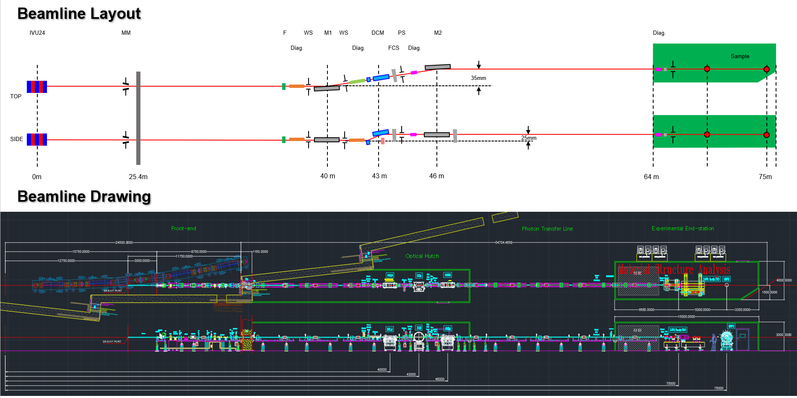

``ID24`` Material Structure Analysis (MSA)
=================================

Introduction
-----------

The Material Structure Analysis (MSA) beamline is a powerful tool
specifically designed for High-Resolution Powder Diffraction (HRPD) and
X-ray Absorption Fine Structure (XAFS). It will be constructed at the
ID24 section of the Korea-4GSR. Operating in the monochromatic 5 ~ 40
keV range, it will receive radiation from an In-Vacuum Undulator (IVU)
as its light source. MSA will provide a beam with a low beam divergence
of IVU, which allows for reducing the spreading of the diffracted beams
from the sample. It is crucial for accurately determining lattice
parameters, crystallite size, and strain in the sample, which leads to
well-defined diffraction peaks. MSA will be utilized to study structure
analysis in various scientific fields including material science,
chemistry, physics, life science, and earth science. The Material
Structure Analysis beamline is classified and constructed as an industry
priority support beamline to respond to the demands of industry fields
and to promote manpower in related fields.

Scientific objectives
---------------------

Material properties are significantly correlated to the crystal
structure and its changes. The crystal structure consists of an array of
unit cells, and understanding these unit cells involves measuring the
lattice parameters. Historically, the scientific measurement of lattice
parameters has been investigated using X-ray diffraction techniques. The
scientific focus of the MSA beamline is to identify crystal structures
to demonstrate material properties. This identification relies on X-ray
diffraction, which is based on Bragg's law. By precisely measuring
diffraction patterns, researchers can determine the crystal structure of
materials, elucidating their properties and behaviors. The MSA beamline
offers a natural beam of approximately 2 mm in the vertical direction
and 1 mm in the horizontal direction at the sample position, located 75
meters away. This configuration provides high statistical accuracy in
experimental results. The experimental equipment is designed to
efficiently measure high-resolution diffraction results using high
fluxes, allowing data to be collected at an accelerated rate each day.
This high efficiency and precision facilitate detailed structural
analysis, essential for understanding and optimizing material
performance in various applications. The insights gained from this
analysis are expected to enhance the performance of battery materials,
improve semiconductor design, and contribute to advancements in
nanotechnology. Understanding the crystal structure also plays a key
role in metallurgy, helping to create stronger and more durable alloys.
Moreover, it supports the study of geological samples, providing
valuable information for both academic research and practical
applications in mining and environmental science.

Beamline Requirements for the Insertion Device
---------------------------------------------

The Material Structure Analysis beamline can provide an energy range of
5-40 keV using an In-Vacuum Undulator (IVU). The high-resolution powder
diffraction techniques will be used at a fixed energy of 20 keV. The
insertion device of Material Structure Analysis beamline is designed to
give the highest brilliance and low divergence in the energy range with
energy continuity above. The parameter specifications for the insertion
device are listed in the table 1. The insertion device has a 24 mm
period and a total length of 3 m. The maximum power is that of the beam
incident through an opening aperture of 2 × 2 mm\ :sup:`2` in front of
the first optical device, high heat load mirror.

Table 1. insertion device parameters

+--------+-----+------+-----+-----+-----+-----------+----------------+
| Und    | Per | Le   | U\  | K   | Po  | Power     | Max. power     |
| ulator | iod | ngth |  :s | \ : | wer | density   | after FE       |
|        |     |      | ub: | sub |     |           |                |
|        | (   | (m)  | `g` | :`m | (   | (kW       | (kW)           |
|        | mm) |      |     | ax` | kW) | mrad\ :   |                |
|        |     |      | (   |     |     | sup:`-2`) |                |
|        |     |      | mm) |     |     |           |                |
+--------+-----+------+-----+-----+-----+-----------+----------------+
| IVU24  | 24  | 3    | 5   | 2.  | 1   | 165       | 0.419          |
|        |     |      | -16 | 747 | 7.9 |           |                |
+--------+-----+------+-----+-----+-----+-----------+----------------+

In order to provide an X-ray Absorption Fine Structure, a beam with
energy change or energy bandwidth of 1 keV should be provided to the
sample from the undulator. To achieve this, positive tapering is
required, which changes the energy by changing the undulator gap or
expands the energy bandwidth by increasing the undulator gap interval
depending on the total length of undulator length. The Material
Structure Analysis beamline provides the beam with the expanded energy
bandwidth using the gap scan that allows high brilliance beam without
reducing flux. Additionally, the insertion device is quipped with a
tapering mode to provide positive tapering as needed.

Beamline Requirements for the Front End
---------------------------------------

The front end of Material Structure Analysis beamline is required to
handle a high heat load of the maximum 18 kW. This total power will be
controlled with three mask systems, 1 fixed mask and 2 movable masks
with water-cooling system. It will feature a keeping aperture size below
1 × 1 mm\ :sup:`2` at the maximum power in order to minimize a slope
error for a vertical beam divergence caused by the heat load in the heat
load mirror, which is essential for maintaining optimal performance.
Depending on the total power with changing undulator gap size, the
aperture size can be adjusted up to ~2 × 2 mm\ :sup:`2`. Further details
are referred in the section of ‘Front End’ in this report.

Beamline Layouts
----------------

|image1|

|image2|

To achieve optimal angular resolution in the MSA, two key factors should
be carefully managed: minimizing beam divergence from the optical device
and reducing the beam divergence through the mirror system. The design
of the MSA is intended to utilize the high flux and low beam divergence
characteristics provided by the storage ring and insertion device to do
efficiently that.

