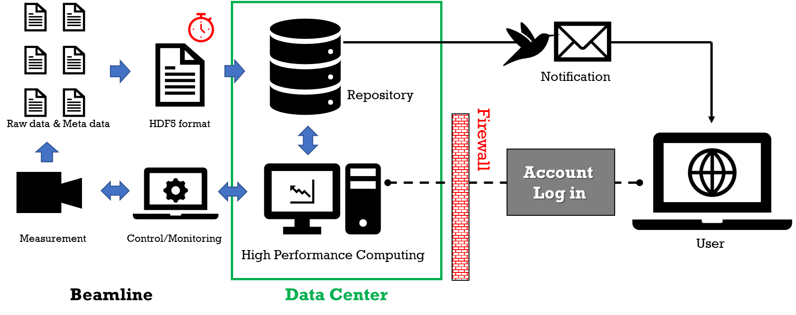
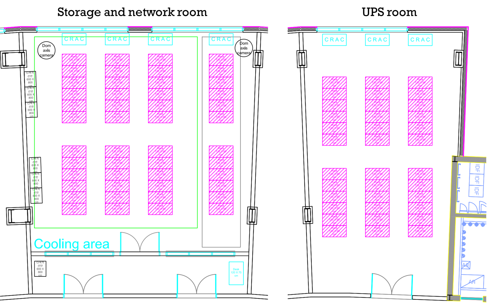

Data Center
===========
1. Introduction
---------------

The Korea 4th Generation Synchrotron Radiation (Korea-4GSR) Accelerator
can generate a large amount of data in a short time due to a dramatic
increase in photon flux and coherence compared to the 3rd generation
synchrotron radiation (3GSR). Korea-4GSR is expected to generate more
than 1.5 PB annually with an initial 10 beamlines. For comparison, the
3GSR accelerator PLS-II at the Pohang Accelerator Laboratory, which
operates 35 beamlines, generates about 1.4 PB annually, indicating a
significant increase in data output per beamline.

The increase in data volume from the 4GSR beamlines cannot be solved by
simply increasing storage capacity. Applying the small-scale data
framework used for the 3GSR to the 4GSR would reduce efficiency in data
analysis due to increased data processing time and management
difficulties, delaying publication. Therefore, the 4GSR accelerator must
provide computing resources to beamline users for fast data processing
and have a system for stable data provision. Overseas institutions
constructing or upgrading 4GSR accelerators are adopting strategies to
handle large data volumes by linking with external data centers to
reduce data generation load or by establishing their own data centers to
upgrade IT infrastructure. Notable examples include the ESRF-EBS and SLS
2.0 in Europe, which supports beamlines and users online by establishing
its own data center, and ALS-U and LCLS in the USA, which employ the
Superfacility strategy by linking with the National Energy Research
Scientific Computer Center (NERSC) to support beamline users [1-3].
Additionally, the NSLS-II at Brookhaven National Laboratory and the
APS-U at Argonne National Laboratory are connected to supercomputers and
high-capacity storage facilities on the same campus, while Japan's
SPring-8/SACLA forms a Big Value Chain involving *Beamline Server -
Beamline Storage - Analysis Support Institutions - User* to provide
flexible resources [4-8].

Similarly, the Korea-4GSR data center aims to support integrated
solutions that provide data storage, management, and user-customized
analysis environments necessary for large-scale data processing
frameworks, beyond the simple storage server.

2. Roles of the Korea-4GSR Data Center
--------------------------------------

The main purposes of the Korea-4GSR data center are as follows (Figure
1):

-  Stable storage of large-scale data.

-  Systematic management of data generated by beamlines.

-  Provision of computing resources to beamlines and users.

   1. **Data Storage**

The new framework introduced to the 4GSR accelerator involves upgrading
the small-scale data algorithms and IT infrastructure used in the 3GSR
to large-scale, but includes newly developed areas such as computing
resource support, adding uncertainties. Additionally, the unclear data
output size from beamlines makes it difficult to accurately predict the
data center's scale, potentially affecting the lead time for resource
procurement. Therefore, the data center will be built through phased
upgrades to minimize risks and prevent unnecessary resource and manpower
waste.

The initial data center will use a distributed storage cluster system,
considering fast data writing and capacity scalability. The initial
storage scale is planned to be 3 PB, expandable up to 186 PB. Most
beamlines will directly connect to the central storage of the data
center, but beamlines with high-data rate such as Bio NX and High Energy
Microscopy will store data on beamline storage and transfer it to the
central storage during machine study or maintenance periods to ease
instantaneous load on storage servers during user beam time.

2. **Data Management**

The synchrotron radiation accelerator contains information from the
storage ring to the Front-End optics hutch and experiment hutch. This is
called metadata, and unless the metadata not required for operation is
specially recorded by beamline users or managers, most of it is lost. To
prevent this, all metadata related to 4GSR operations and experiments is
structured and stored in HDF5 format along with the measured data. The
HDF5 format can be used regardless of the operating system [9].

Overseas, data storage periods, ownership, access rights, storage, and
deletion follow established data policies. Although Korea-4GSR's data
policy has not been established yet, the initial phase will delete data
due to limited storage space. For example, when 1/3 of the total storage
capacity is filled, data will be deleted in the order it was created,
with automatic notification emails sent 30, 15, 7, and 2 days before
deletion to the email registered to the user's account. If beamline
users apply for an extension of the preservation period for data
scheduled for deletion, a decision will be made after review.

3. **User Support**

To build a large-scale data framework, data management generated from
beamlines and accelerators should be easy, and an immediate response
structure to data processing requests should be established. Therefore,
the data center will configure an HPC (High Performance Computing)
system capable of processing mass data quickly, supporting a total of
480 CPU cores. The data center will also configure a network and
management system to allow flexible use of HPC from all beamlines.

Experimental groups or researchers performing experiments at 4GSR will
have their own user home directory, and will be supported to analyze
data stored in the Korea-4GSR data center through web browser apps like
Jupyter Hub. Since the initial network and HPC resources of the data
center are not large enough to be provided simultaneously to multiple
users accessing the external Internet, applications for resource
utilization will be limited.

4. **DAQ development support**

When addressing the requirements for beamline development and
operational support, there are two approaches that can be adopted. One
approach is for the beamline itself to handle all requirements,
including experiment control, data and metadata pipeline, data
processing, data storage, and IT infrastructure. The other approach is
to address the beamline's requirements centrally. Each approach has
advantages in terms of flexibility, innovation support, and
standardization, but due to the limitations of Korea-4GSR's human
resources, a hybrid model is inevitably necessary.

The goal is to apply a standardized EPICS-based layout for each beamline
DAQ (Data Acquisition). This allows new types of experiments to be
implemented on other beamlines simply by porting. However, depending on
the complexity, new EPICS-based system implementations may be required
on other beamlines. In addition, the development and maintenance of
interfaces independent of beamline dependencies are required. Therefore,
to support beamline DAQ, it is essential to strengthen knowledge
exchange between the beamline and the data center, enabling the review
and support of migration ease and operational support levels/models.

3. Data Center Facilities
-------------------------

The data center will be located in Research Bldg. 1, with a dedicated
area of about 150 m² and a total supplied apparent power of 220 kVA. The
data center is divided into a network room that can accommodate 12
racks, a storage and HPC room that can accommodate 36 racks, and an
office room to monitor the data center (Figure 2). The space
accommodating the racks is equipped with air-cooled constant temperature
and humidity control to minimize hardware failures by controlling heat
generated from machines and blocking moisture, and it is separated from
the office space. A 300 mm high raised floor is installed to form a
floor cold air plenum, designed to withstand a load of 0.8 tons per
square meter. Network trays are installed on the ceiling to consider
wiring efficiency.

   Figure 1 A schematic diagram of data management and user support

   Figure 2 Korea-4GSR data center layout in Research Bldg. 1. The green
   rectangular space is for storage and HPC, while the gray rectangular
   space on the left is for network equipment racks. The pink diagonal
   area indicates slots where racks can be placed.

References
----------

[1]
https://www.esrf.fr/files/live/sites/www/files/about/information-material/ESRF_IT_Strategy.pdf

[2] Conceptual Design Report on Controls and Science IT for the SLS 2.0
Upgrade Project (2021).

[3] B. Enders et al., Cross-facility science with the Superfacility
Project at LBNL (2020). 2020 IEEE/ACM 2\ :sup:`nd` annual workshop on
extreme-scale experiment-in-the-loop computing

[4] The Advanced Photon Source Strategic Plan (2021).

[5] I. Latif et al., Finalizing Construction of a New Data Center at BNL
(2021). EPJ Web of Conference **251**, 02069

[6] 2023 NSLS-II Strategic Pan (2021).

[7] T. Hatsui et al., SPring-8 Data Center Initiative: Toward
processing, analysis, and reuse of exabyte-scale scientific data (2023).
HPCI

[8] K. Nakajima et al., (2022). J. Phys.: Conf. Ser. **2380**, 012101

[9] M. Könnecke et al., (2015). J. Appl. Cryst. **48**, 301
